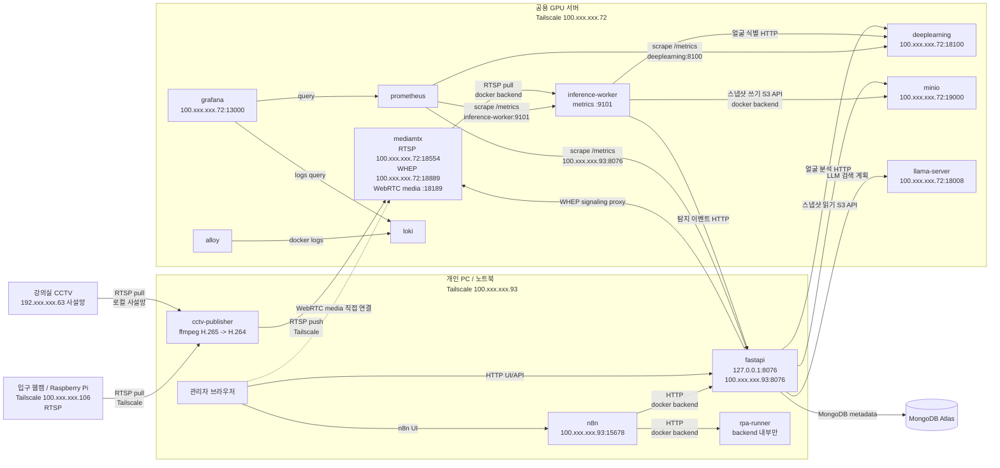

# 스마트 클래스 모니터링

어디있조 팀 프로젝트. 강의실 카메라 영상에서 학생을 식별하고, 지정 좌석과 대조해
관리자가 볼 수 있는 학생 상태를 만든다.

## 목차

- [프로젝트 목적](#프로젝트-목적)
- [시스템 아키텍처](#시스템-아키텍처)
- [기술 스택](#기술-스택)
- [추론 모델](#추론-모델)
- [필요한 기기](#필요한-기기)
- [실행 방법](#실행-방법)
- [현재 단계](#현재-단계)
- [디렉터리 구조](#디렉터리-구조)
- [팀원이 가장 먼저 읽을 문서](#팀원이-가장-먼저-읽을-문서)
- [AI 에이전트 사용 방법](#ai-에이전트-사용-방법)
- [새로 추가할 때 위치](#새로-추가할-때-위치)
- [기여 흐름](#기여-흐름)
- [확정된 결정](#확정된-결정)

## 프로젝트 목적

강의실 카메라 영상에서 **학생을 식별**하고, 그 학생의 **현재 위치**를 **지정 좌석**과
**수업 시간 정책**에 결합해, 관리자가 강의실을 직접 돌지 않아도 학생 현황을 확인할 수
있게 한다. 확인된 상태를 이용한 반복 업무는 별도의 RPA 자동화로 처리한다.

**얼굴 인식 시스템이 아니다.** 얼굴 인식은 학생을 식별하는 수단이고, 제품이 내놓는
것은 출결 판단에 쓸 수 있는 학생 상태다.

| 상태 | 의미 | 범위 |
| --- | --- | --- |
| `PRESENT` | 학생이 식별됐고 지정 좌석에 있다 | MVP |
| `WRONG_SEAT` | 학생이 식별됐으나 지정 좌석이 아니다 | MVP |
| `ABSENT` | 수업 시간 중 유예 시간을 넘겨 미식별 | MVP |
| `IN_CLASSROOM` | 신원 있는 track이 교실 안에 있으나 좌석 ROI 밖이다 | MVP |

**식별과 위치는 서로 다른 카메라가 담당한다.** 입구 카메라가 얼굴로 신원을 한 번 정하고,
그 신원을 트래킹으로 이어 강의실 전체를 보는 CCTV에서 좌석을 판정한다. 좌석 화각에서는
얼굴을 인식하지 않는다.

무엇을 만들 것인지는 [학생 모니터링 MVP 명세](./docs/specs/student-monitoring-mvp.md)에 있다.

## 시스템 아키텍처

카메라 두 대가 서로 다른 일을 한다. **입구 웹캠은 얼굴로 신원을 정하고, CCTV는 사람을
추적해 좌석을 판정한다.** 두 화각은 겹치지 않으므로, 문 영역과 통과 시각을 근거로 입구의
신원을 CCTV track에 넘긴다.

두 카메라 모두 개인 PC의 publisher를 거쳐 GPU 서버 MediaMTX로 모인다. CCTV는 사설망에서
바로 받고, 입구 웹캠은 라즈베리파이가 tailnet으로 내보낸 RTSP를 받는다. GPU 서버는 카메라
주소도 자격 증명도 알지 못하고 MediaMTX 경로만 읽는다.



**실행 호스트는 둘이다.** 개인 PC에 `fastapi`·`n8n`·CCTV publisher를, GPU 서버에 추론
worker·`deeplearning`·LLM과 MediaMTX·MinIO·모니터링을 두고 Tailscale로 잇는다. MongoDB는
Atlas라 호스트와 무관하다.
**개발·검증용 구성이며 운영 배포가 아니다.**

| 호스트 | 올라가는 것 | 이유 |
| --- | --- | --- |
| 개인 PC(노트북) | `fastapi`, `n8n` + `rpa-runner`, 카메라 publisher | 백엔드 개발이 공용 서버의 가용성에 묶이지 않게 한다. CCTV 사설망에 닿는 유일한 기기이기도 하다 |
| 공용 GPU 서버 | `worker`, `deeplearning`, llama-server, MediaMTX, MinIO, Prometheus·Grafana·Loki·Alloy | GPU가 필요하거나 영상이 지나가는 것만 남긴다 |
| MongoDB Atlas | 메타데이터·학생 상태·탐지 이벤트 | 관리형이라 호스트와 무관하다 |

지켜야 하는 경계는 셋이다.

- **브라우저는 `fastapi`만 호출한다.** `deeplearning`·`worker`에 직접 접근하지 않는다.
- **`deeplearning`의 출력은 "사람 1명 탐지, 신뢰도 0.87"까지다.** `PRESENT` 같은 업무
  해석은 `fastapi`가 한다.
- **영상과 메타데이터의 저장 책임을 나눈다.** 이미지는 MinIO, 나머지는 MongoDB다.
  영상 원본은 저장하지 않고 스냅샷만 남긴다.

서비스 사이의 관계는 [아키텍처 문서](./docs/architecture/README.md)에 더 자세히 있다.

## 기술 스택

| 영역 | 사용 기술 |
| --- | --- |
| 웹·화면 | FastAPI, Uvicorn, Jinja2, Pydantic v2 / pydantic-settings. **프런트엔드 빌드 도구를 쓰지 않는다** — 정적 JS·CSS를 그대로 서빙한다 |
| 데이터 | MongoDB(Atlas) — 메타데이터·상태 이력·탐지 이벤트(TTL 삭제). MinIO — 탐지 스냅샷과 세그먼트 |
| 영상 전달 | MediaMTX 1.20 (RTSP 수신·WebRTC 송출), FFmpeg (HEVC→H.264 변환 publish), OpenCV |
| 추론 실행 | Ultralytics 8.4.123, 자체 구현 ByteTrack(+Kalman 예측), onnxruntime-gpu 1.28(CUDA), InsightFace 1.0.1, MediaPipe 1.0 |
| LLM | llama.cpp server(CUDA 빌드) + Gemma GGUF. 자연어 탐지 검색에만 쓴다 |
| 업무 자동화 | n8n 2.33.5 + `rpa-runner`(표준 라이브러리만 쓰는 Python 사이드카) |
| 관측 | Prometheus, Grafana, Loki, Alloy, `prometheus-client` |
| 실행·배포 | Docker Compose(`.docker/`), GitHub Actions(CI·GHCR·SSH 배포), Tailscale |
| 품질 도구 | ruff, mypy(strict), pytest, node 기반 워크플로 테스트 |

## 추론 모델

모델을 아는 곳은 [`deeplearning`](./deeplearning/README.md)과 `worker/inference` 둘뿐이고,
그 안에 업무 해석을 넣지 않는다.

| 단계 | 모델 | 실행 위치 | 비고 |
| --- | --- | --- | --- |
| 사람 탐지 | YOLO(Ultralytics). 자체 학습한 `person-v0002` | `worker/inference` (GPU) | 원본 프레임 계약(`original-frame-v1`)으로 학습하고 가중치 SHA-256·클래스·image size를 `model_contract.json`으로 검증한다. 하나라도 다르면 기동하지 않는다. 고정 validation 80장에서 mAP50 0.957, confidence 0.30에서 F1 0.927 |
| 사람 추적 | ByteTrack 자체 구현 + Kalman bbox 예측 | `worker/inference` | 신뢰도 2단계 연관(high 0.5 / low 0.1)으로 가림 직후의 ID 단절을 줄인다. 카메라마다 ID 공간을 나눈다 |
| 얼굴 검출 | SCRFD 10G (`scrfd_10g_bnkps.onnx`) | `deeplearning` (onnxruntime CUDA) | 입구 카메라와 얼굴 등록에서만 쓴다. 좌석 화각에서는 얼굴을 보지 않는다 |
| 얼굴 인식 | ArcFace `buffalo_l/w600k_r50.onnx`(기본) 또는 AdaFace IR50 WebFace4M | `deeplearning` | 한 배포에서 `FACE_RECOGNIZER`로 **한 모델만** 켠다. embedding 공간이 호환되지 않아 갤러리 컬렉션을 나누고 임계값도 모델별로 FAR 0.001에서 고른다 |
| 얼굴 자세·품질 | MediaPipe Face Landmarker (`face_landmarker.task`) | `deeplearning` (CPU) | 얼굴 등록 화면의 실시간 촬영 가이드 |
| 자연어 검색 | Gemma GGUF (llama.cpp server) | GPU 서버 | **LLM은 검색 계획 JSON만 만든다.** 검증·조회는 fastapi가 하고 조회 Tool을 모델에 주지 않는다. GPU가 없는 환경에서는 기능을 끈다 |

판정에 쓰는 값도 모델과 함께 고정돼 있다. 추론은 image size 1280·confidence 0.25로 돌고,
좌석 점유는 confidence 0.3 이상 bbox의 **중심점**이 좌석 ROI 안에 들어올 때 인정하며 마지막
관측 뒤 5초간 유지한다. 앉은 사람은 하반신이 책상에 가려 bbox 하단이 발에서 끊기지 않기
때문이고, 근거는 각 `config/settings.yml` 주석에 적어 두었다.

작은 얼굴을 Super Resolution으로 풀지 않는다. 얼굴 인식을 얼굴이 크게 잡히는 입구에서만
하도록 카메라 구성을 바꿨다.

## 필요한 기기

| 기기 | 역할 | 지금 상태 |
| --- | --- | --- |
| 전체 조망 CCTV 1대 | 강의실 전체를 보고 사람 탐지·좌석 판정에 쓴다 | 있다. **어안이 아니라 일반 광각**이고 출력이 HEVC라 개인 PC가 H.264로 바꿔 보낸다 |
| 입구 웹캠 1대 | 문을 지나는 학생의 얼굴을 찍는다. 신원은 여기서 한 번만 정한다 | USB 웹캠을 라즈베리파이에 물려 쓴다 |
| Raspberry Pi 1대 | 웹캠 영상을 RTSP로 내보내는 카메라 노드 | tailnet(`100.xxx.xxx.106`)에 붙어 있어야 개인 PC publisher가 끌어갈 수 있다 |
| 개인 PC(노트북) | `fastapi`·`n8n`·publisher 실행 | Docker Desktop과 Tailscale이 필요하다. CCTV 사설망과 tailnet 양쪽에 붙어 있어야 한다 |
| 공용 GPU 서버 | worker·deeplearning·LLM·MediaMTX·MinIO·모니터링 | NVIDIA L40S 4장 중 **1장만 우리 계정에 할당돼 있고 llama-server도 같은 GPU를 쓴다** |
| 네트워크 | 두 호스트를 Tailscale로 잇는다 | 개인 PC에 공인 IP가 없어 서로를 tailnet 주소로 부른다 |

**라즈베리파이는 subnet router가 아니라 카메라 노드로 쓴다.** GPU 서버 LAN과 CCTV 사설망의
주소 대역이 겹쳐 사설망 route를 포기했고, 두 카메라를 모두 개인 PC publisher가 받아
GPU 서버로 넘기는 방식으로 바꿨다. 파이는 웹캠 영상을 tailnet에 RTSP로 올리는 일만 한다.

커밋된 publisher 구성(`.docker/compose.publisher.dev.pc.yml`)에는 CCTV 경로만 들어 있다.
입구 웹캠 RTSP는 같은 방식으로 한 서비스를 더 붙여 넘긴다.

카메라가 없어도 화면은 볼 수 있다. `DEMO_MODE_ENABLED=true`면 합성 영상으로 모니터링·검색
흐름을 시연한다. 실제 스트림·추론이 아니다.

## 실행 방법

### 1. 화면과 API만 띄운다 (카메라·GPU 없이)

```bash
cd webapps/fastapi
python -m pip install -r requirements.txt
cp .env.example .env.local
python -m uvicorn app.main:app --reload --port 8001
```

기본값이 `APP_ENV=local`, `DATABASE_MODE=memory`라 외부 서비스 없이 뜬다.
`http://127.0.0.1:8001`로 접속한다. 화면·환경변수·API 계약은
[fastapi README](./webapps/fastapi/README.md)가 기준이다.

### 2. dev 스택 (컨테이너)

**컨테이너로 띄우는 구성은 dev 하나뿐이다.** GPU 서버 스택을 먼저 올린다 — network를
그쪽이 만든다.

```bash
# 공용 GPU 서버
docker compose -f .docker/compose.main.dev.gpu.yml up -d
docker compose -f .docker/compose.llm.dev.yml up -d
docker compose -f .docker/compose.monitoring.dev.yml up -d

# 개인 PC (tailscale status로 tailnet 연결을 먼저 확인한다)
docker compose -f .docker/compose.main.dev.pc.yml pull
docker compose -f .docker/compose.main.dev.pc.yml up -d
docker compose -f .docker/compose.publisher.dev.pc.yml up -d   # 카메라 송출
```

| 주소 | 무엇 |
| --- | --- |
| `http://localhost:8076` | 웹 화면·API (개인 PC) |
| `http://localhost:15678` | n8n 편집기 (개인 PC) |

**GPU 서버 스택이 없어도 화면과 API는 뜬다.** 대신 그쪽을 부르는 기능이 각각 실패한다 —
얼굴 등록(deeplearning), 스냅샷 목록(MinIO), 자연어 검색(llama-server), 실시간
영상(MediaMTX). 비밀값(`.docker/env/`)과 모델 가중치(`.docker/models/`)는 커밋하지 않으므로
각자 채워야 한다. 절차와 포트는 [.docker/README.md](./.docker/README.md)가 기준이다.

### 3. 영상 파이프라인 (worker)

```bash
cd worker
python -m pip install -r pipeline/requirements.txt
python -m pipeline.main        # stream + inference를 함께 돌린다
```

카메라 주소·모델 경로·신원 인계 설정은 `pipeline/.env.*`가 소유한다. 실행 절차는
[worker/pipeline README](./worker/pipeline/README.md)를 따른다.

### 4. 검증

```bash
# 저장소 최상위에서
(cd webapps/fastapi && python -m ruff check app tests && python -m mypy app tests && python -m pytest -q)
(cd worker && python -m pytest -q)
node RPAs/study-status-report/tests/period_report.test.js      RPAs/study-status-report/workflows/study-status-report.n8n.json
```

fastapi 1111건, worker 442건, RPA 워크플로 테스트 3종이 장비·모델·MinIO 없이 돈다.
mypy는 strict라 공개 함수에 타입 힌트가 없으면 실패한다.

## 현재 단계

핵심 실행 코드는 `webapps/fastapi`, `worker`, `deeplearning`, `RPAs` 네 곳에 있다.

- **`webapps/fastapi`** — 강의실·좌석·좌석 지정과 학생 상태, 학생 등록과 얼굴 등록,
  좌석 ROI 연결, 입구→CCTV 신원 인계 설정, 실시간 모니터링, 탐지 스냅샷, 자연어
  탐지 검색 화면과 그 API. worker가 식별한 학생을 카메라별 좌석 ROI와
  좌석 지정에 대조해 `PRESENT`·`WRONG_SEAT`·`UNKNOWN`을 계산하고 REST와 SSE로 제공한다.
  좌석 점유 상태는 여전히 "자리가 찼는지"이고 학생 상태와는 별도다. 자연어 탐지
  검색은 LLM이 질문을 검색 조건으로 바꾸고 fastapi가 검증·조회한다.
  **이 기능만은 GPU가 있는 환경에서만 켠다** — 그 밖의 환경에서는 꺼져 있고 화면이
  그 사실을 안내한다.
  local/dev에서는 실제 영상이나 개인정보 없이 합성 모니터링·검색 흐름을 시연할 수 있다.
- **`worker`** — 카메라 영상을 받아(`stream`) 프레임을 골라 탐지하고(`inference`),
  탐지 인원 수가 바뀌면 스냅샷을 객체 저장소에 올린다.
  **영상 원본은 저장하지 않는다**.
  세그먼트 적재용 `recorder`는 코드가 남아 있으나 공용 서버에서 실행하지 않는다.
  `FASTAPI_URL`을 설정하면 탐지 결과를 `/internal/inference/events`로 제한 재시도하며
  전달한다. `FACE_IDENTITY_URL`과 입구 카메라 ID를 설정하면 그 카메라는 YOLO 없이
  deeplearning의 SCRFD→ArcFace→얼굴 track만 실행한다. CCTV는 YOLO 사람 탐지와
  ByteTrack만 실행한다. 두 역할은 별도 최신 프레임 버퍼·소비자를 사용해 얼굴 HTTP가
  느려도 CCTV 추적을 막지 않는다. 입구 얼굴 관측은 FastAPI에 7일 메타데이터로 저장한다.
  FastAPI의 `/identity-handover`
  화면에서 저장한 CCTV 문 ROI를 주기적으로 읽어 입구 신원을 CCTV ByteTrack으로
  넘기며, 설정 조회가 잠시 실패하면 마지막 정상값을 유지한다. 기본값은 꺼져 있다.

`deeplearning`에는 얼굴 등록용 SCRFD 검출·MediaPipe 자세 분석, 갤러리 얼굴 식별
내부 서비스와 모델 학습·얼굴 식별 평가용 Jupyter/CLI 도구가 있다.
얼굴 인식은 배포마다 활성 모델 하나만 켠다 — 기본은 ArcFace이고 AdaFace는 갤러리를
따로 두고 검증 뒤에 전환한다.

`monitoring/internal`에는 Grafana 데이터소스·대시보드 provisioning이 있다.
Prometheus·Loki·Alloy 설정 파일은 아직 `.docker/` 아래에 있으며, 통합 실행 수단이
공식화되면 옮긴다([monitoring/internal README](./monitoring/internal/README.md)).

`RPAs`에는 자습 현황 보고 워크플로 [`study-status-report`](./RPAs/study-status-report/README.md)가
있다. 시간표를 읽어 교시마다 FastAPI에서 학생 상태를 받고, 유의미한 상태 변화를 관리
문서(`.xlsx`)에 적어 교시가 끝날 때 Slack에 올리며, 주간 집계는 메일로 보낸다. 개인 PC
스택의 `n8n`·`rpa-runner` 컨테이너가 실행한다.

입구 카메라의 얼굴 track과 특정 학생 식별, CCTV 사람 ByteTrack, 문 영역·통과
시각을 이용한 입구→CCTV 신원 인계가 코드와 합성 테스트로 연결됐다.
CCTV detection의 `student_id`와 `track_id`는 FastAPI의 ROI·좌석 판정을 거쳐 저장·SSE·
화면까지 전달된다. `/identity-handover`에서 CCTV 현재 화면에 문 영역을 겹쳐 보고 다시
그리면 worker가 재시작 없이 반영한다. 입구 사람 track ID가 바뀌더라도 활성 학생 하나를
CCTV track 하나에만 인계한다. 얼굴 track은 위치와 embedding을 함께 확인하고 낮은 품질의
새 관측에는 과거 이름을 노출하지 않으며, CCTV track이 만료되면 인계 신원도 즉시 지운다.
남은 일은 실제 입구 카메라·CCTV로 하는 종단 간 검증, 문 영역·인계 시간 창 보정,
시간표 기반 `ABSENT` 판정이다.

## 디렉터리 구조

```text
webapps/       웹 애플리케이션
deeplearning/  모델 추론 (사람 탐지 · 얼굴 탐지 · 얼굴 인식)
worker/        영상 수신 · 프레임 공급 · 추론 실행 · 녹화
monitoring/    Prometheus·Grafana 설정 / 사용자용 실시간 영상
docs/          문서, AI 에이전트 규칙, 프롬프트
RPAs/          업무 자동화 프로젝트
.docker/       docker compose 실행 구성 (환경별로 나뉜다)
.github/       이슈·PR 템플릿과 GitHub Actions 워크플로
README.md      이 문서
```

최상위에는 위 항목과 `.gitignore`만 둔다. 빌드 설정, 그 밖의 인프라 파일, 에이전트
문서를 최상위에 새로 만들지 않는다.
`.docker/`는 팀 공식 실행 수단으로 정한 유일한 인프라 예외이며, 그 안의 `env/`(비밀값)와 `models/`(가중치)는 커밋하지 않는다.
자세한 예외 범위는
[AGENTS.md의 Repository Structure](./docs/agents/AGENTS.md#repository-structure)에 있다.

### 서비스

| 디렉터리 | 역할 | 상태 |
| --- | --- | --- |
| [webapps/fastapi](./webapps/fastapi/README.md) | FastAPI 웹 애플리케이션. API와 Jinja2 화면을 제공하는 유일한 외부 진입점. 학생 상태 판정을 소유한다. | 동작. 강의실·좌석·학생·얼굴 등록·ROI 연결·신원 인계·모니터링·스냅샷·자연어 검색 화면과 REST·SSE API. **로그인·사용자 관리·알림은 없다** |
| [worker](./worker/README.md) | 영상 파이프라인 워커 묶음(`stream`·`inference`·`recorder`)과 공용 계약(`shared`)·조립 진입점(`pipeline`). | 동작. `recorder`는 공용 서버에서 실행하지 않는다 |
| [deeplearning](./deeplearning/README.md) | 사람 탐지, 얼굴 탐지, 얼굴 인식 모델. 모델을 아는 유일한 곳. | 입구 SCRFD·ArcFace 식별·얼굴 추적·MediaPipe 자세와 평가 하네스 구현. worker의 CCTV 사람 ByteTrack·보수적 신원 인계와 연결됨 |
| [monitoring/internal](./monitoring/internal/README.md) | **내부 모니터링.** 운영자가 서비스 자체를 보는 Prometheus·Grafana 설정. | 세 서비스 지표 수집 + Grafana 대시보드 둘(스택 상태·애플리케이션 지표). 알림 규칙은 아직 없음 |
| [monitoring/external](./monitoring/external/README.md) | **외부 모니터링.** 사용자에게 제품으로 제공하는 실시간 영상. | 코드 없음. 설정·문서만 두기로 정했다 |
| [RPAs](./RPAs/README.md) | 업무 자동화 워크플로. 프로젝트별 독립 디렉터리. | [`study-status-report`](./RPAs/study-status-report/README.md) 하나 동작(n8n + 보고서 생성 스크립트) |

`webapps/`는 웹 애플리케이션 전용이다. 웹 요청을 처리하지 않는 서비스는
최상위에 독립 디렉터리로 둔다.

### docs

| 디렉터리 | 역할 |
| --- | --- |
| `docs/agents` | AI 에이전트가 지켜야 할 작업 규칙 |
| `docs/prompts` | 바로 복사해 쓰는 작업 프롬프트 |
| `docs/architecture` | [구조 설명](./docs/architecture/README.md)과 [결정 기록](./docs/architecture/decisions.md) |
| `docs/specs` | 구현 전 합의한 기능 명세 — [학생 모니터링 MVP](./docs/specs/student-monitoring-mvp.md) |
| `docs/conventions` | Git·코딩·API·환경변수·문서 규칙 |
| `docs/guides` | [개발 가이드](./docs/guides/README.md) — 실행·검증 명령과 작업 흐름 |
| `docs/templates` | 복사해 쓰는 문서 템플릿 — [서비스 README](./docs/templates/service-readme-template.md), [기능 명세](./docs/templates/feature-spec-template.md), [API 명세](./docs/templates/api-spec-template.md), [트러블슈팅](./docs/templates/troubleshooting-template.md) |

### RPAs

업무 자동화 프로젝트를 프로젝트별 독립 디렉터리로 관리한다.
공통 규칙은 [RPAs/README.md](./RPAs/README.md)에 있다.

현재 워크플로는 [`study-status-report`](./RPAs/study-status-report/README.md) 하나다.
FastAPI가 저장한 학생 상태를 읽어 관리 문서와 보고서를 만들고 Slack·메일로 보낸다.
**상태 판정을 직접 트리거로 삼지 않는다** — 보고 대상은 관리자가 확인하는 기록이다.

**AI 판정만으로 보호자나 담당자에게 메시지를 보내지 않는다.**
관리자 확인과 승인을 거친 뒤 RPA가 실행한다.

## 팀원이 가장 먼저 읽을 문서

1. 이 문서
2. [학생 모니터링 MVP 명세](./docs/specs/student-monitoring-mvp.md) — 무엇을 만드는가
3. 담당 서비스 디렉터리의 `README.md`
4. [아키텍처](./docs/architecture/README.md) — 서비스 관계와 미결정 항목
5. 개발 규칙 — [Git](./docs/conventions/git-convention.md) · [코딩](./docs/conventions/coding-convention.md) · [API](./docs/conventions/api-convention.md) · [환경변수](./docs/conventions/environment-convention.md) · [문서](./docs/conventions/documentation-convention.md)
6. [개발 가이드](./docs/guides/README.md) — 실행하고 검증하는 명령

## AI 에이전트 사용 방법

이 저장소는 AI 코딩 에이전트와 함께 작업하는 것을 전제로 한다.

- 공통 작업 계약은 [docs/agents/AGENTS.md](./docs/agents/AGENTS.md)에 있다. 에이전트는 이 문서를 먼저 읽는다.
- 역할별 규칙: [FastAPI](./docs/agents/fastapi-agent.md) · [AI](./docs/agents/ai-agent.md) · [RPA](./docs/agents/rpa-agent.md) · [문서](./docs/agents/documentation-agent.md)
- 반복 작업은 Claude Code 스킬을 따른다. `/skills`로 목록을 볼 수 있다.
  스킬은 `.claude/skills/`에 있으며 **저장소에 포함되지 않는다.** 팀원과는 따로 공유한다.
- 작업 지시는 `docs/prompts/`의 템플릿을 복사해 변수를 채운 뒤 사용한다.
  [프로젝트 초기화](./docs/prompts/initialize-project.md) · [기능 구현](./docs/prompts/implement-feature.md) · [버그 조사](./docs/prompts/investigate-bug.md) · [PR 리뷰](./docs/prompts/review-pull-request.md) · [문서 갱신](./docs/prompts/update-project-docs.md)
- 저장소를 직접 읽지 못하는 도구(웹 GPT 등)로 작업할 때는
  [GPT 코딩 프롬프트](./docs/prompts/gpt-agent.md)의 규칙 블록을 대화에 붙여넣는다.

에이전트 관련 문서는 모두 `docs/` 아래에 두며, 최상위에 `AGENTS.md`를 만들지 않는다.

## 새로 추가할 때 위치

| 추가할 것 | 위치 | 참고 |
| --- | --- | --- |
| 새 웹 애플리케이션 | `webapps/<service-name>/` | [서비스 README 템플릿](./docs/templates/service-readme-template.md) |
| 웹이 아닌 새 서비스 | 최상위 `<service-name>/` | 동일. AGENTS.md의 최상위 제약도 갱신한다 |
| fastapi의 새 기능 | `webapps/fastapi/app/<기능>/` | `create-fastapi-feature` 스킬 |
| 새 RPA | `RPAs/<rpa-name>/` | [RPA 규칙](./RPAs/README.md) |
| 구현 전 기능 명세 | `docs/specs/` | [기능 명세 템플릿](./docs/templates/feature-spec-template.md) |
| 아키텍처 결정 | `docs/architecture/decisions.md` | [기록 방법](./docs/architecture/decisions.md#어떻게-기록하는가). 결정마다 파일을 만들지 않는다 |
| 개발 규칙 | `docs/conventions/` | 기존 문서 수정을 우선 |
| 작업 절차 | `.claude/skills/<skill-name>/` | 저장소 밖. 작성법은 `.claude/skills/README.md` |
| 문서 템플릿 | `docs/templates/` | |

## 기여 흐름

1. 작업 대상 디렉터리의 README와 관련 규칙 문서를 읽는다.
2. `develop`에서 브랜치를 만들어 작업한다.
3. 변경 범위를 작게 유지한다.
4. 가능한 검증을 실행하고, 실행하지 못한 검증은 그대로 밝힌다.
5. 문서 갱신이 필요한지 확인한다.
6. `develop`으로 Pull Request를 열어 리뷰를 요청한다.

PR과 `develop` push에서 [CI](./.github/workflows/ci.yml)가 변경 범위를 판정해
fastapi·worker의 린트·타입 검사·테스트를 돌리고, `develop` 병합 시 fastapi 이미지를
GHCR에 올린다. GPU 서버에 반영되는 경로가 바뀌면
[배포 워크플로](./.github/workflows/deploy-gpu-server.yml)가 SSH로 compose 설정을
반영한다.

비밀키와 실제 환경변수 값은 어떤 경우에도 커밋하지 않는다.
**학생 얼굴이 담긴 영상·이미지·캡처도 커밋하지 않는다.**
상세 규칙은 [Git 규칙](./docs/conventions/git-convention.md)에 있다.

## 확정된 결정

확정된 결정은 [결정 기록](./docs/architecture/decisions.md)에 있다.
fastapi 내부 구조, 설계 패턴 판단 기준, 메타데이터 저장소(MongoDB),
영상·얼굴 이미지 저장소(MinIO), worker 분리와 프레임 전달, 상태 판정 소유 서비스,
추론 책임 경계, MVP 제품 사용자 범위, 실시간 관제의 HTTP·WebRTC·SSE 구성,
실시간 영상의 인증 최소화가 여기에 해당한다. 마지막 대역(0043~0051)은 실측으로 병목을 찾아 고친 결정들이다 —
탐지 결과 전송을 추론 소비자에서 떼어내고 밀리면 최신만 남기기, 탐지 이벤트의 MongoDB
TTL 삭제, 좌석 관측의 batch transaction 적용, bbox 오버레이를 저장과 다른 경로로 보내기,
얼굴 모델의 GPU 이전, 모델 교체의 계약·해시 검증, 좌석 ROI 자동 생성을 탐지 밀도 경로
하나로 줄이기가 들어 있다.

**운영 접근 통제는 MVP 동안 도입하지 않기로 했다.** 그래서 `APP_ENV=prod` 배포는
하지 않는다.
