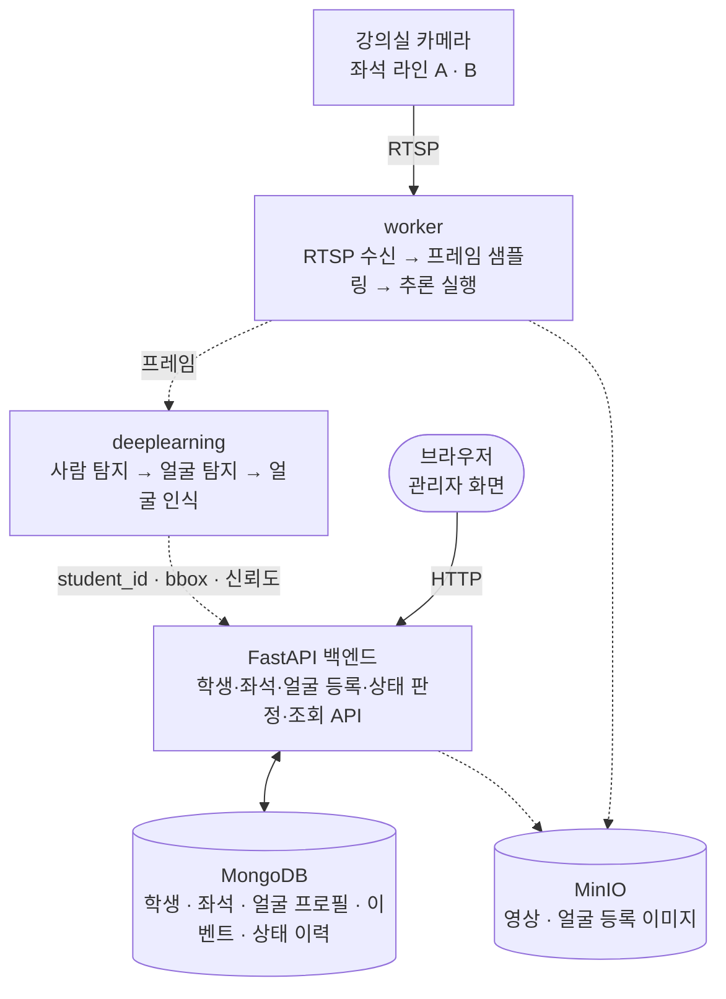

# 아키텍처

**목적**: 시스템이 어떤 블록으로 나뉘고, 그 블록이 저장소의 어느 디렉터리에 대응하며,
서로 어떤 방향으로 호출하는지 한 곳에서 파악한다.
**대상 독자**: 이 저장소에서 처음 작업을 시작하는 팀원과 AI 에이전트.

각 서비스의 내부 책임과 환경변수는 여기서 반복하지 않는다. 해당 서비스의 README에 있다.
확정된 기술 결정과 그 근거는 [결정 기록](./decisions.md)에 있다.
무엇을 만들 것인지는 [학생 모니터링 MVP 명세](../specs/student-monitoring-mvp.md)에 있다.

표기: (표기 없음) `사실` / `예정`(하기로 했으나 아직 없음) / `후보`(고려 중) / `결정 필요`(선택하지 않음)

## 이 시스템이 하는 일

강의실 카메라 영상에서 **학생을 식별**하고, 그 학생의 **현재 위치**를 **지정 좌석**과
**수업 시간 정책**에 결합해 관리자가 강의실 단위 학생 현황을 자동으로 확인하게 한다.

얼굴 인식은 학생을 식별하는 수단이고, 제품이 최종적으로 내놓는 것은 **학생 상태**다.

| 상태 | 의미 | 범위 |
| --- | --- | --- |
| `PRESENT` | 학생이 식별됐고 지정 좌석에 있다 | MVP |
| `WRONG_SEAT` | 학생이 식별됐으나 지정 좌석이 아니다 | MVP |
| `ABSENT` | 수업 시간 중 지정 좌석에서 유예 시간을 넘겨 미식별 | MVP |
| `IN_CLASSROOM` | 좌석에는 없지만 교실 안에 있다 | 최종 확장. 지속적 위치 추적이 필요하다 |

## 시스템 구성



실선은 현재 동작하는 경로다. 점선은 서비스 또는 계약이 아직 없는 `예정` 경로다.

**관리자 화면은 별도 서비스가 아니다.** FastAPI가 Jinja2로 직접 렌더링하는 같은
프로세스 안의 화면이다. 프론트엔드 서비스를 따로 두지 않는다.

## 블록과 디렉터리의 대응

| 구성도 블록 | 담당 디렉터리 | 상태 |
| --- | --- | --- |
| 관리자 화면 | [`webapps/fastapi`](../../webapps/fastapi/README.md) (`templates/`) | 강의실 좌석 현황·모니터링·검색 세 화면만 있다 |
| FastAPI 백엔드 API | [`webapps/fastapi`](../../webapps/fastapi/README.md) (`app/`) | 좌석 점유 조회와 데모 영상·검색까지. **학생 식별·얼굴 등록·상태 판정은 `예정`** |
| 카메라 실시간 수신, 프레임 샘플링 | [`worker/stream`](../../worker/stream/README.md) | 동작. 다중 RTSP 소스 수신·재연결·샘플링. 로컬 저장은 개발용이며 기본 꺼짐 |
| 추론 실행 단계 | [`worker/inference`](../../worker/inference/README.md) | 동작. 결과 전달 경로는 `예정`. 모델 호출은 `deeplearning` 이관 대상([결정 0009](./decisions.md#0009--추론-책임을-모델과-실행으로-나눈다)) |
| 사람 탐지 · 얼굴 탐지 · 얼굴 인식 모델 | [`deeplearning`](../../deeplearning/README.md) | SCRFD 검출·MediaPipe 자세 내부 HTTP 서비스 구현. 나머지 품질·인식은 `예정` |
| 학생 상태 판정 | `webapps/fastapi` | `예정`. 소유 서비스는 fastapi로 확정([결정 0008](./decisions.md#0008--학생-상태-판정을-rule-engine으로-분리하고-fastapi가-소유한다)) |
| MongoDB 저장 | `webapps/fastapi`의 어댑터 | 강의실·좌석·관측 컬렉션만 구현됨 |
| 영상을 객체 저장소에 적재 | [`worker/recorder`](../../worker/recorder/README.md) | 동작하나 **공용 서버에서 실행하지 않는다.** 영상 원본을 저장하지 않기로 했다([결정 0011](./decisions.md#0011--영상-원본을-저장하지-않고-스냅샷만-남긴다)) |
| 탐지 시점 스냅샷 적재 | [`worker/inference`](../../worker/inference/README.md) | 동작. 탐지 개수가 바뀌면 JPEG를 MinIO에 올린다([결정 0011](./decisions.md#0011--영상-원본을-저장하지-않고-스냅샷만-남긴다)). 기본은 꺼짐 |
| 스냅샷 조회 화면·API | `webapps/fastapi`의 `app/snapshots/` | 동작. MinIO 목록을 읽어 보여준다. 이미지는 fastapi가 프록시한다 |
| 지표·대시보드 | [`monitoring/internal`](../../monitoring/internal/README.md) | Grafana 설정(데이터소스·대시보드 1개)만 있다. **수집할 지표가 없어 Prometheus 설정과 알림 규칙은 `예정`** |
| 사용자용 실시간 영상 | [`monitoring/external`](../../monitoring/external/README.md) | `예정`. WebRTC로 확정. 코드 없음. 디렉터리 경계·접근 보호는 `결정 필요` |
| 업무 자동화 | [`RPAs`](../../RPAs/README.md) | `예정`. 코드 없음 |

## 지금 동작하는 것과 목표의 거리

```text
현재                          목표

카메라                        카메라
  ↓                             ↓
worker/stream                 worker/stream
  ↓                             ↓
worker/inference              worker/inference → deeplearning
  ↓                             ↓
(로그 출력)                   탐지 결과(student_id · bbox)
  ✕                             ↓
FastAPI                       FastAPI (좌석 대조 + 시간 정책)
                                ↓
                              MongoDB → 관리자 화면
```

**끊긴 지점은 `worker/inference`와 `fastapi` 사이 하나다.** 전달 방식이
`결정 필요`이며, 이것이 정해지기 전에는 화면의 좌석 상태가 자동으로 갱신되지 않는다.

현재 fastapi가 보여 주는 좌석 상태(`OCCUPIED` / `VACANT` / `UNKNOWN`)는 **자리가
찼는지**를 뜻할 뿐 **누가 앉았는지**를 뜻하지 않는다. 학생 식별과 지정 좌석 대조는
아직 구현되어 있지 않다.

## fastapi에 들어올 도메인

[결정 0001](./decisions.md#0001--fastapi-계층형-구조와-경계-포트)에 따라 기능(도메인)별
디렉터리로 나눈다. 아래 셋은 `예정`이며 계약은
[MVP 명세](../specs/student-monitoring-mvp.md)가 기준이다.

| 도메인 | 책임 | 상태 |
| --- | --- | --- |
| `classrooms` | 강의실, 좌석, 좌석 ROI, 좌석 점유 관측 | 구현됨(ROI·지정 좌석은 `예정`) |
| `video_monitoring` | 영상 source 목록과 상태, 검색 | 데모까지 구현됨 |
| `students` | 학생 원장 — 식별자, 학번, 소속 강의실, 동의 상태 | `예정` |
| `face_enrollment` | 학생 ID와 얼굴 embedding의 연결, 등록 세션 | `예정` |
| `student_monitoring` | 탐지 결과 수신, 좌석 대조, 시간 정책, 학생 상태와 이력 | `예정` |

## 호출 방향 규칙

아래는 [AGENTS.md의 Architecture Rules](../agents/AGENTS.md#architecture-rules)와 같은 내용이며,
여기서는 그 배경을 설명한다.

### 제품 요청은 fastapi를 통하고 영상만 WebRTC로 MediaMTX에 연결한다

`deeplearning`과 `worker`를 브라우저에서 직접 부르지 않는다.
접근 통제를 한 곳에서 하고, 추론 결과 형식이 바뀌어도 영향 범위를
`fastapi` 안에 가두기 위해서다.

실시간 영상은 예외다. [결정 0011](./decisions.md#0011--실시간-관제-전달을-httpwebrtcsse로-구성한다)에
따라 fastapi가 재생 가능한 source를 판단하고, 브라우저는 허용된 WebRTC 세션에 한해
MediaMTX와 signaling·미디어 연결을 맺는다. 제품 API와 탐지 SSE는 계속 fastapi만
호출한다.

### 모델은 상태를 결정하지 않는다

모델의 출력은 `student_001, 신뢰도 0.87, bbox (100,120,300,600)`까지다.
이것을 `PRESENT`나 `WRONG_SEAT`으로 바꾸는 것은 `fastapi`의 일이다.

출결 정책이 바뀌어도 모델을 다시 학습하거나 배포하지 않고, 모델을 교체해도
업무 규칙이 유지되게 하려는 것이다. 배경은
[결정 0008](./decisions.md#0008--학생-상태-판정을-rule-engine으로-분리하고-fastapi가-소유한다)에 있다.

판정에서 지키는 것:

- 판단 기준(유예 시간, 신뢰도 임계값, 좌석 판정 여유)은 코드에 박지 않고 설정으로 둔다.
- `deeplearning`과 `worker`에 업무 상태 어휘(`PRESENT`, `ABSENT`)를 넣지 않는다.
- **미관측을 부재로 바꾸지 않는다.** 카메라 장애·가림과 학생의 부재는 다른 사실이다.
- 조회 GET은 상태를 바꾸지 않는다. 시간 정책은 명시적인 쓰기 요청에서만 평가한다.

### 모델을 아는 곳은 deeplearning 하나다

`worker/inference`는 프레임을 꺼내 호출하고 실패를 처리하는 실행 단계이고,
모델 종류·가중치·전처리는 `deeplearning`이 소유한다
([결정 0009](./decisions.md#0009--추론-책임을-모델과-실행으로-나눈다)).
**현재 코드는 이 경계를 아직 만족하지 않는다.** `worker/inference`가 ultralytics를
직접 부르며, `deeplearning` 구현 시 이관한다.

### 영상·얼굴 데이터와 메타데이터의 저장 책임을 분리한다

바이너리와 메타데이터는 보존 기간, 용량, 접근 권한이 전혀 다르다.
한 서비스가 둘 다 소유하지 않는다.

- 업무 메타데이터: `fastapi`가 MongoDB에 기록한다.
- **영상 원본: 저장하지 않는다.** 탐지 시점의 스냅샷만 MinIO에 남기고 메타데이터에는
  참조만 둔다([결정 0011](./decisions.md#0011--영상-원본을-저장하지-않고-스냅샷만-남긴다)).
  `worker/recorder`는 코드가 남아 있으나 공용 서버 스택에서 실행하지 않는다.
- 얼굴 등록 이미지: `fastapi`가 MinIO의 별도 버킷에 넣는다(`예정`). 영상과 버킷을
  나누는 이유는 보존 기간과 열람 주체가 다르고, 학생 요청으로 삭제할 수 있어야
  하기 때문이다([결정 0004](./decisions.md#0004--영상과-얼굴-이미지-저장소로-minio-채택)).

**상시 녹화는 하지 않는다.** 공용 GPU 서버의 가용 용량이 약 48 GB인데 1080p 카메라
한 대가 시간당 약 0.9 GB라 성립하지 않는다. 그래서
[결정 0007](./decisions.md#0007--recorder-worker의-저장-구조와-보존-정책)의 상시 녹화와
보존 기간 30일 기본값은 0011로 대체됐다.

스냅샷 값은 720p / JPEG 80 / 보존 30일 / 카메라당 최소 간격 60초로 정했다.
삭제는 앱이 아니라 MinIO lifecycle 규칙이 한다.

**접근 권한과 얼굴 데이터 정책은 여전히 `결정 필요`다 — 스냅샷에도 얼굴이 담긴다.**
지금은 worker와 fastapi가 모두 root 자격 증명으로 저장소에 붙는다.
`worker/stream`의 로컬 저장은 학습 데이터 확보용이며 기본값이 꺼져 있고
`APP_ENV=prod`에서는 켤 수 없다.

### 서비스 간 계약은 문서화된 것만 쓴다

각 서비스는 상대의 내부 구조를 모른 채 동작해야 한다.
현재 실행 중인 서비스 사이에 구현된 계약은 없다. 첫 계약인 탐지 결과 전달은
[결정 0011](./decisions.md#0011--실시간-관제-전달을-httpwebrtcsse로-구성한다)에 따라
worker가 fastapi의 내부 HTTP API를 호출하며, 구체 스키마는
[API 규칙](../conventions/api-convention.md)을 따른다.

## 데이터 흐름

### 지금 동작하는 흐름

```text
브라우저 → fastapi 라우터 → 도메인 서비스 → 저장소 포트
        → memory 또는 MongoDB 어댑터 → JSON 응답 또는 Jinja2 화면
```

```text
카메라 ─RTSP─▶ MediaMTX → OpenCV(worker/stream)
                          → 프레임 샘플링 → 프레임 버퍼(최신 1장)
                          → worker/inference ┬→ 탐지 결과 로그
                                             │  (fastapi로 넘기는 경로는 아직 없다)
                                             │
                                             └→ 탐지 개수가 바뀌면 JPEG 스냅샷
                                                → MinIO (lifecycle이 30일 뒤 삭제)
                                                       ▲
                                    fastapi ───목록·이미지 읽기───┘
```

**영상 원본은 저장하지 않는다**(결정 0011). `worker/recorder`의 세그먼트 녹화 경로는
코드가 남아 있으나 공용 서버에서 실행하지 않는다.

fastapi는 스냅샷을 **저장소에서 직접 읽는다.** 객체 키에 카메라와 시각이 담겨 있어
메타데이터 저장소 없이도 목록이 된다. 탐지 결과 자체(신뢰도·bbox)를 넘기는 경로는
여전히 없으므로, 화면의 좌석 상태는 실제 관측이 아니라 저장된 관측 기록을 보여 주는
것이며 운영 공급원이 없으면 `UNKNOWN`·미관측 상태로 남는다.

### 예정 학생 상태 흐름

| 단계 | 입력 | 출력 | 담당 | 상태 |
| --- | --- | --- | --- | --- |
| 1. 수집 | 카메라 영상 | 연속 프레임 | worker/stream | 구현됨 |
| 2. 샘플링 | 연속 프레임 | 추론 대상 프레임 | worker/stream | 구현됨 |
| 3. 사람 탐지 | 프레임 | 사람 ROI·좌표·신뢰도 | deeplearning | `예정`(현재 worker/inference가 대신함) |
| 4. 얼굴 탐지·인식 | 사람 ROI | `student_id` 또는 `UNKNOWN`·신뢰도 | deeplearning | `예정` |
| 5. 전달 | 탐지 결과 | 수신된 이벤트 | worker → fastapi HTTP | `예정`([결정 0011](./decisions.md#0011--실시간-관제-전달을-httpwebrtcsse로-구성한다)) |
| 6. 좌석 대조 | 위치 + 좌석 ROI | 현재 좌석 / 지정 좌석 일치 여부 | fastapi | `예정` |
| 7. 상태 판정 | 좌석 대조 + 수업 시간 + 유예 시간 | 학생 상태 | fastapi | `예정` |
| 8. 저장·표시 | 상태·이벤트 | 이력과 화면 | fastapi | 화면 골격만 구현됨 |

- **2단계에서 모든 프레임을 추론에 보내지 않는다.** 샘플링 주기는 설정값으로 둔다.
- **4단계까지는 의미를 부여하지 않는다.** `student_001, conf 0.87`까지가 출력이다.
- **6~7단계에서 처음으로 업무 의미가 생긴다.** 3~4단계 결과가 아직 여기 닿지 않아
  현재는 로그로만 나간다.

각 단계는 다음 단계가 멈춰도 전체가 무너지지 않게 만든다.
**2→3단계에서 추론이 밀리면 프레임을 버린다.** 쌓아두면 결과가 가리키는 시점이
계속 과거로 밀리기 때문이며, 배경은
[결정 0006](./decisions.md#0006--워커-사이-프레임-전달을-최신-우선-버퍼로-한다)에 있다.
5단계는 HTTP timeout·제한 재시도·`event_id` 멱등 처리를 사용한다. 구체 timeout,
재시도 횟수, worker 전송 버퍼 정책과 내부 인증은 구현 계약에서 정한다.

### 얼굴 등록 흐름 (`예정`)

```text
학생 등록 → 얼굴 샘플 수집 → 품질 판정(흐림·밝기·크기) → embedding 생성
        → Face Profile 저장(MongoDB 메타데이터 + MinIO 이미지)
```

품질 판정은 모델이 아니라 규칙으로 시작한다. 등록 시점의 각도 보정에 head pose
모델을 쓸지는 `후보`다. 원본 이미지를 남길지 embedding만 남길지는 개인정보 합의
사항이며 `결정 필요`다.

## 시스템 경계

### 행위자

| 행위자 | 무엇을 하는가 | 상태 |
| --- | --- | --- |
| 관리자 | 학생 등록, 지정 좌석 설정, 얼굴 등록, 강의실 현황 확인, 상태 수동 보정, 검색, RPA 승인 | 화면 일부만 구현됨 |
| 학생 | **사용자가 아니다.** 시스템의 관찰 대상이며 얼굴 등록 동의 주체다 | — |

MVP의 제품 사용자는 관리자 한 종류다
([결정 0010](./decisions.md#0010--mvp-제품-사용자를-관리자-하나로-한정한다)).
**현재 앱에는 인증이 없다.** 운영 접근 통제 방식이 `결정 필요`이며, 정해지기 전까지
`APP_ENV=prod` 배포를 하지 않는다.

### 외부 시스템

| 외부 시스템 | 관계 | 상태 |
| --- | --- | --- |
| 강의실 카메라 / Jetson | 영상 스트림 공급 | USB 카메라 1대로 확인됨. 강의실 2대 구성과 Jetson은 `예정` |
| MongoDB | 운영 메타데이터 보관 | 구현됨 |
| MinIO | 영상·얼굴 이미지 보관 | `worker/recorder`가 영상을 적재·삭제한다. 얼굴 이미지는 `예정` |
| 기존 학사·출결 시스템 | RPA가 접근해 업무 대행 | 대상 미확정 |
| 알림 채널 | 관리자 승인 후 담당자·보호자에게 알림 | `결정 필요` |

### 시스템 밖에 두는 것

- 카메라 장비 자체의 설정과 펌웨어
- 학생 원장의 원본 관리 — 기존 학사 시스템이 있다면 그쪽이 정본이다
- 수업 시간표의 원본 관리 (`결정 필요` — 이 시스템이 들고 있을지 받아올지)
- 기존 출결 시스템의 기능 (RPA는 이를 **사용**할 뿐 대체하지 않는다)
- 알림 채널 자체의 운영

외부 시스템의 동작을 우리 쪽에서 흉내 내지 않는다. 연동이 불안정하면 감추지 말고
실패로 드러낸다.

### 제약

- **얼굴은 그 자체로 개인정보다.** 등록 동의, 저장 범위, 보존 기간, 접근 권한,
  삭제 절차가 아직 정해지지 않았다. 학생이 미성년자일 수 있어 동의 주체도 확인이 필요하다.
- **영상에도 얼굴이 담긴다.** `worker/recorder`가 합의보다 먼저 만들어졌으므로
  ([0007](./decisions.md#0007--recorder-worker의-저장-구조와-보존-정책)),
  합의를 미룰수록 지우기 어려운 데이터가 쌓인다.
- **출결은 사람에게 불이익을 줄 수 있는 판정이다.** 자동 판정만으로 통보하지 않고
  관리자 확인을 거친다. 판정 근거가 되는 이벤트를 되짚을 수 있어야 한다.
- **오인식은 다른 학생의 정보를 노출하는 사고다.** 신뢰도 미달은 `UNKNOWN`으로 두고
  억지로 이름을 붙이지 않는다.
- **장치는 자주 끊긴다.** 카메라 연결 실패를 예외가 아니라 정상 운영 중 발생하는 상태로 다룬다.
- **외부 시스템 접근 정보는 저장소에 두지 않는다.**
  [환경변수 규칙](../conventions/environment-convention.md)을 따른다.

## 미결정 항목

| 항목 | 상태 | 영향 |
| --- | --- | --- |
| 얼굴 데이터 운영 접근 권한과 재학 종료 자동 삭제 실행 주체 | 결정 필요 | local 구현은 가능하지만 **실제 얼굴의 prod 처리를 막는다**. 동의·보관·중단 삭제 정책은 [0011](./decisions.md#0011--얼굴-등록-실시간-경계와-데이터-수명)로 확정 |
| 영상 저장 범위·보존 기간·접근 권한 | 결정 필요 | 개인정보 합의 사항. **코드가 먼저 만들어져 기본값으로 동작 중**([0007](./decisions.md#0007--recorder-worker의-저장-구조와-보존-정책)) |
| 운영 접근 통제 방식(내부망 / reverse proxy / 상위 시스템 위임) | MVP 동안 미도입([0012](./decisions.md#0012--실시간-영상-접근-제어와-운영-배포를-mvp-동안-인증-최소화로-정한다)) | **prod 배포를 계속 막는다**([0010](./decisions.md#0010--mvp-제품-사용자를-관리자-하나로-한정한다)) |
| 스냅샷 버킷의 접근 권한과 전용 자격 증명 | 결정 필요 | 지금은 root 키로 붙는다. worker(쓰기)·fastapi(읽기)를 나눠야 한다 |
| 영상·스냅샷 접근 권한 | 결정 필요 | 개인정보 합의 사항. 스냅샷에도 얼굴이 담긴다 |
| 운영 접근 통제 방식(내부망 / reverse proxy / 상위 시스템 위임) | 결정 필요 | **prod 배포를 막는다**([0010](./decisions.md#0010--mvp-제품-사용자를-관리자-하나로-한정한다)) |
| 얼굴 탐지 모델 | 후보: SCRFD | deeplearning |
| 얼굴 인식 모델 | 후보: AdaFace R50, ArcFace (비교 후 결정) | deeplearning |
| 사람 탐지 모델 버전 | 후보: YOLO 계열 (현재 코드는 YOLOv8n) | deeplearning, worker |
| 학습 데이터셋 확보·라벨링 정책 | 결정 필요 | deeplearning |
| 학습 가중치를 `worker/inference` 실행 환경까지 전달하는 방식 | 후보: MinIO | deeplearning, worker |
| `deeplearning` 호출 방식(라이브러리 import / 별도 프로세스) | 결정 필요 | worker, deeplearning |
| 결석 유예 시간 값 | 후보: 5 / 10 / 20 / 30분 | fastapi. 실제 촬영과 운영 요구 필요 |
| 좌석 판정 방식(bbox 중심점·하단점 / ROI 겹침 비율) | 결정 필요 | fastapi. 실제 촬영 필요 |
| 수업 시간표의 원본 관리 주체 | 결정 필요 | fastapi |
| 카메라 배치(대수·높이·화각·거리) | 결정 필요 | 실제 촬영으로 확정한다 |
| 작은 얼굴 대응 — Super Resolution 도입 여부 | 후보. 카메라 배치·렌즈·crop 개선을 먼저 시도한다 | deeplearning |
| Tracking(ByteTrack 등) 도입과 `IN_CLASSROOM` | 결정 필요 | MVP 범위 밖 |
| 일반 모니터링 화면 갱신 방식(폴링 / SSE / WebSocket) | 결정 필요 | 얼굴 등록은 [0011](./decisions.md#0011--얼굴-등록-실시간-경계와-데이터-수명)에 따라 WebSocket 확정. 일반 모니터링은 미정 |
| 브라우저 영상 재생 방식(WebRTC 중계 / HLS) | 결정 필요 | fastapi, worker, monitoring |
| `monitoring/external`의 경계(설정·문서만 / 서비스 코드 포함) | 설정·문서만([0012](./decisions.md#0012--실시간-영상-접근-제어와-운영-배포를-mvp-동안-인증-최소화로-정한다)) | monitoring, fastapi |
| 자연어 검색 방식(LLM + 허용된 조회 Tool) | 후보: LangGraph | fastapi. MVP 이후 |
| 캐시·큐 도입 여부 | 후보: Redis | fastapi |
| Jetson 적용 범위 | 결정 필요 | worker |
| 알림 채널과 RPA 대상 시스템 | 결정 필요 | RPAs, fastapi |
| 통합 실행 수단(docker compose)의 공식화 | 결정 필요 | 전체 |
| 배포 환경과 방식 | 결정 필요 | 전체 |

이 중 하나를 확정하면 [결정 기록](./decisions.md)에 한 항목을 추가하고,
이 표와 [루트 README의 미결정 항목](../../README.md#아직-결정되지-않은-항목)을 함께 갱신한다.

## 관련 문서

- [학생 모니터링 MVP 명세](../specs/student-monitoring-mvp.md) — 무엇을 만들 것인가
- [결정 기록](./decisions.md) — 확정된 기술 결정과 그 근거
- [AGENTS.md](../agents/AGENTS.md) — 에이전트 작업 계약
- [개발 규칙](../conventions/) — Git·코딩·API·환경변수·문서
