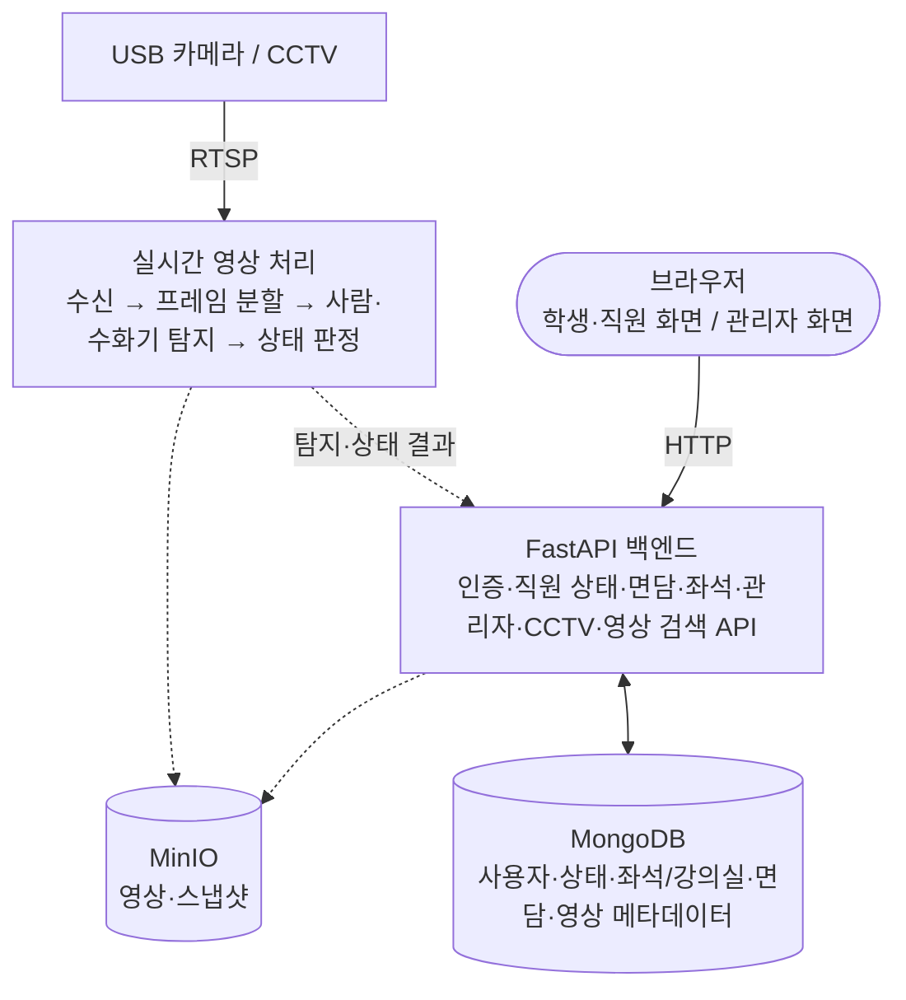

# 아키텍처

**목적**: 시스템이 어떤 블록으로 나뉘고, 그 블록이 저장소의 어느 디렉터리에 대응하며,
서로 어떤 방향으로 호출하는지 한 곳에서 파악한다.
**대상 독자**: 이 저장소에서 처음 작업을 시작하는 팀원과 AI 에이전트.

각 서비스의 내부 책임과 환경변수는 여기서 반복하지 않는다. 해당 서비스의 README에 있다.
확정된 기술 결정과 그 근거는 [결정 기록](./decisions.md)에 있다.

표기: (표기 없음) `사실` / `예정`(하기로 했으나 아직 없음) / `후보`(고려 중) / `결정 필요`(선택하지 않음)

## 시스템 구성



실선은 현재 동작하는 경로다. 점선은 서비스 또는 계약이 아직 없는 `예정` 경로다.

**학생·직원 화면과 관리자 화면은 별도 서비스가 아니다.** FastAPI가 Jinja2로 직접 렌더링하는
같은 프로세스 안의 화면 묶음이다. 브라우저에서 보이는 앱이 둘이라고 해서 배포 단위가
둘인 것은 아니다.

## 블록과 디렉터리의 대응

| 구성도 블록 | 담당 디렉터리 | 상태 |
| --- | --- | --- |
| 학생·직원 화면, 관리자 화면 | [`webapps/fastapi`](../../webapps/fastapi/README.md) (`templates/`) | 구현됨 |
| FastAPI 백엔드 API | [`webapps/fastapi`](../../webapps/fastapi/README.md) (`app/`) | 대부분 구현됨. CCTV 스트리밍·영상 검색은 local/dev 합성 데모까지만 |
| CCTV 실시간 수신, 프레임 분할 | [`worker/stream`](../../worker/stream/README.md) | 동작. 다중 RTSP 소스 수신·재연결·샘플링. 로컬 저장은 개발용이며 기본 꺼짐 |
| 사람·수화기 탐지 | [`worker/inference`](../../worker/inference/README.md) | 동작. YOLOv8n으로 탐지까지. 결과 전달 경로는 `예정`. [`deeplearning`](../../deeplearning/README.md)과의 경계는 `결정 필요` |
| 상태 판정 | [`worker/state`](../../worker/state/README.md) 또는 `webapps/fastapi` | `예정`. 소유 서비스 `결정 필요`. 아래 [상태 판정은 누가 하는가](#상태-판정은-누가-하는가) 참고 |
| MongoDB 저장 | `webapps/fastapi`의 어댑터 | 구현됨 |
| 영상을 객체 저장소에 적재 | [`worker/recorder`](../../worker/recorder/README.md) | `예정`. 저장 범위 미합의 |
| 지표·대시보드 | [`monitoring/internal`](../../monitoring/internal/README.md) | Grafana 설정(데이터소스·대시보드 1개)만 있다. **수집할 지표가 없어 Prometheus 설정과 알림 규칙은 `예정`** |
| 사용자용 실시간 영상 모니터링 | [`monitoring/external`](../../monitoring/external/README.md) | `예정`. 코드 없음. 디렉터리 경계와 재생 방식이 `결정 필요` |
| 업무 자동화 | [`RPAs`](../../RPAs/README.md) | `예정`. 코드 없음 |

구성도에는 MinIO가 없지만 영상·스냅샷 저장소는 MinIO로 확정되어 있다
([결정 0004](./decisions.md#0004--영상스냅샷-저장소로-minio-채택)).
구성도가 저장 대상을 MongoDB의 "영상 메타데이터 DB"까지만 그린 것은,
**영상 원본을 무엇을 얼마나 저장할지가 아직 합의되지 않았기 때문**이다.

## API와 저장 데이터

구성도의 FastAPI 블록과 MongoDB 블록의 대응이다. 실제로 공개되는 경로와 필드는
`/docs`와 [fastapi README](../../webapps/fastapi/README.md#화면과-api)가 기준이다.

| 구성도의 API | 저장 대상 | 현재 상태 |
| --- | --- | --- |
| 인증 API | 사용자 | 구현됨 |
| 직원 상태 API | 사용자, 상태 | 구현됨. 탐지 기반 자동 전이는 `예정` |
| 면담 API | 면담 | 구현됨 |
| 좌석·강의실 API | 좌석/강의실 | 구현됨 |
| 관리자 API (대시보드·사용자·직원·강의실) | 사용자, 상태, 좌석/강의실 | 구현됨 |
| CCTV 스트리밍 API | — | local/dev 합성 데모만. 실제 스트림 중계 `예정` |
| 자연어 영상 검색 API | 영상 메타데이터 | local/dev 고정 catalog 검색만. 질의 해석 `예정` |

## 호출 방향 규칙

아래는 [AGENTS.md의 Architecture Rules](../agents/AGENTS.md#architecture-rules)와 같은 내용이며,
여기서는 그 배경을 설명한다.

### 브라우저는 fastapi만 호출한다

`deeplearning`과 `worker`를 브라우저에서 직접 부르지 않는다.
인증과 권한 판정을 한 곳에서 하고, 추론 결과 형식이 바뀌어도 영향 범위를
`fastapi` 안에 가두기 위해서다.

영상 스트림을 브라우저에서 직접 재생해야 하면 이 규칙의 예외가 필요할 수 있다.
`결정 필요` 항목이며, 확정 시 [결정 기록](./decisions.md)에 남긴다.

### 탐지와 해석을 분리한다

`deeplearning`의 출력은 "사람 1명 탐지, 신뢰도 0.87"까지다.
이것을 "근무중"이나 "통화중"으로 해석하는 것은 `fastapi`의 일이다.

모델을 교체해도 업무 규칙이 유지되고, 판단 기준이 바뀌어도 모델을 다시
배포하지 않기 위해서다.

### 상태 판정은 누가 하는가

구성도는 상태 판정을 영상 처리 파이프라인 안에 그렸지만, 위 규칙은 해석을
`fastapi`의 책임으로 둔다. **어느 쪽으로 할지는 아직 확정되지 않았다.**

확정 전까지는 다음을 지킨다.

- 판단 기준(미탐지 지속 시간, 신뢰도 임계값)은 코드에 박지 않고 설정으로 둔다.
- `deeplearning`에 업무 상태 어휘(`근무중`, `부재중`)를 넣지 않는다.
- 확정하면 [결정 기록](./decisions.md)에 남기고 이 절과 아래 미결정 항목 표를 함께 지운다.

### 영상과 메타데이터의 저장 책임을 분리한다

영상 바이트와 메타데이터는 보존 기간, 용량, 접근 권한이 전혀 다르다.
한 서비스가 둘 다 소유하지 않는다.

- 업무 메타데이터: `fastapi`가 MongoDB에 기록한다.
- 영상·스냅샷: **`worker/recorder`가 저장소로 넘긴다.** MinIO에 보관하고 메타데이터에는
  참조만 남긴다. 실시간 영상을 받아 저장소와 추론 모델에 넘기는 것이 `worker`의 책임이다.
  **저장 범위와 보존 기간은 아직 `결정 필요`이므로, 확정 전까지 상시 저장 기능을 만들지 않는다.**
  `worker/stream`의 로컬 저장은 학습 데이터 확보용이며 기본값이 꺼져 있고
  `APP_ENV=prod`에서는 켤 수 없다.

### 서비스 간 계약은 문서화된 것만 쓴다

각 서비스는 상대의 내부 구조를 모른 채 동작해야 한다.
현재 실행 중인 서비스 사이의 계약은 없다. 첫 계약을 정의할 때
[API 규칙](../conventions/api-convention.md)을 따른다.

## 데이터 흐름

### 지금 동작하는 흐름

```text
브라우저 → fastapi 라우터 → 도메인 서비스 → 저장소 포트
        → memory 또는 MongoDB 어댑터 → JSON 응답 또는 Jinja2 화면
```

```text
USB 카메라 → FFmpeg → MediaMTX(RTSP) → OpenCV(worker/stream)
          → 프레임 샘플링 → 프레임 버퍼(최신 1장) → worker/inference(YOLOv8n)
          → 탐지 결과 로그 (fastapi로 넘기는 경로는 아직 없다)
          → 원본 영상 파일 + 학습용 프레임 이미지 (개발용, 기본 꺼짐)
```

두 흐름은 아직 이어져 있지 않다. 직원 상태와 좌석 관측은 `MOCK_INPUTS_ENABLED`인
local/dev에서 사람이 구조화된 값으로 입력한다. 운영 화면에는 입력 도구가 없다.

GET 요청은 시간 정책이나 상태 전이를 실행하지 않는다. 시간 기반 평가는 명시적인
쓰기 요청에서만 수행한다.

### 예정 영상 흐름

| 단계 | 입력 | 출력 | 담당 | 상태 |
| --- | --- | --- | --- | --- |
| 1. 수집 | 카메라 영상 | 연속 프레임 | worker/stream | 구현됨 |
| 2. 샘플링 | 연속 프레임 | 추론 대상 프레임 | worker/stream | 구현됨 |
| 3. 탐지 | 프레임 | 객체·좌표·신뢰도 | worker/inference | 구현됨 |
| 4. 해석 | 탐지 결과 | 업무 의미가 부여된 상태 | 소유 서비스 `결정 필요` | `예정` |
| 5. 저장 | 상태·이벤트 | 저장된 레코드 | fastapi | `예정` |
| 6. 표시 | 조회 결과 | 화면 | fastapi | 구현됨(수동 입력 기준) |

- **2단계에서 모든 프레임을 추론에 보내지 않는다.** 샘플링 주기는 설정값으로 둔다.
- **3단계는 의미를 부여하지 않는다.** `person 1, conf 0.87`까지가 출력이다.
- **4단계에서 처음으로 업무 의미가 생긴다.** 3단계 결과가 아직 여기 닿지 않아
  현재는 로그로만 나간다.

각 단계는 다음 단계가 멈춰도 전체가 무너지지 않게 만든다.
**2→3단계에서 추론이 밀리면 프레임을 버린다.** 쌓아두면 결과가 가리키는 시점이
계속 과거로 밀리기 때문이며, 배경은
[결정 0008](./decisions.md#0008--워커-사이-프레임-전달을-최신-우선-버퍼로-한다)에 있다.
3→4단계의 실패 정책은 전달 방식과 함께 아직 `결정 필요`다.

## 시스템 경계

### 행위자

| 행위자 | 무엇을 하는가 | 상태 |
| --- | --- | --- |
| 학생 (`STUDENT`) | 직원 상태·강의실 좌석 조회, 본인 면담 신청·처리 | 구현됨 |
| 직원 (`STAFF`) | 접수된 본인 면담 처리, 본인 근무 상태 override, 좌석 조회 | 구현됨 |
| 관리자 (`ADMIN`) | 사용자·직원·강의실 관리, 경고 해결, 운영 요약 조회 | 구현됨 |

제품 권한 모델은 위 세 역할이다. 저장 데이터 역직렬화를 위해 남아 있는 레거시 역할의
경계는 [결정 0006](./decisions.md#0006--v2-제품-경계와-레거시-호환성)에 있다.

### 외부 시스템

| 외부 시스템 | 관계 | 상태 |
| --- | --- | --- |
| USB 카메라 / CCTV / Jetson | 영상 스트림 공급 | USB 카메라 1대 연동됨. Jetson은 `예정` |
| MongoDB | 운영 메타데이터 보관 | 구현됨 |
| MinIO | 영상·스냅샷 보관 | 확정됐으나 연동 `예정` |
| 알림 채널 | 이벤트 발생 시 담당자에게 알림 | `결정 필요`. 현재는 인앱 알림만 |
| 사내 업무 시스템 | RPA가 접근해 업무 대행 | 대상 미확정 |

### 시스템 밖에 두는 것

- 카메라 장비 자체의 설정과 펌웨어
- 사내 계정 체계와 조직 정보의 원본 관리
- 사내 업무 시스템의 기능 (RPA는 이를 **사용**할 뿐 대체하지 않는다)
- 알림 채널 자체의 운영

외부 시스템의 동작을 우리 쪽에서 흉내 내지 않는다. 연동이 불안정하면 감추지 말고
실패로 드러낸다.

### 제약

- **영상은 개인정보를 포함한다.** 저장 범위·보존 기간·접근 권한을 정하지 않은 상태로
  영상을 저장하는 기능을 만들지 않는다.
- **장치는 자주 끊긴다.** 카메라 연결 실패를 예외가 아니라 정상 운영 중 발생하는 상태로 다룬다.
- **외부 시스템 접근 정보는 저장소에 두지 않는다.**
  [환경변수 규칙](../conventions/environment-convention.md)을 따른다.

## 미결정 항목

| 항목 | 상태 | 영향 |
| --- | --- | --- |
| 상태 판정 로직의 소유 서비스 | 결정 필요 | deeplearning, fastapi |
| worker 프로세스 분리 시점(추론을 GPU 노드로) | 결정 필요 | worker. [0008](./decisions.md#0008--워커-사이-프레임-전달을-최신-우선-버퍼로-한다)에서 당분간 한 프로세스로 정함 |
| 탐지 결과 전달 방식(동기 HTTP / 메시지 큐) | 결정 필요 | 전체 |
| 실시간 화면 갱신 방식(폴링 / SSE / WebSocket) | 결정 필요 | fastapi |
| 브라우저 영상 재생 방식(WebRTC 중계 / HLS) | 결정 필요 | fastapi, worker |
| `monitoring/external`의 경계(설정·문서만 / 서비스 코드 포함) | 결정 필요 | monitoring, fastapi |
| 실시간 영상에서 "브라우저는 fastapi만 호출한다"를 유지할지 | 결정 필요 | fastapi, monitoring |
| 캐시·큐 도입 여부 | 후보: Redis | fastapi |
| 영상 저장 범위·보존 기간·접근 권한 | 결정 필요 | 개인정보 관련 합의 사항 |
| 모델 종류와 버전 | 후보: YOLO 계열 | deeplearning |
| Jetson 적용 범위 | 결정 필요 | worker |
| 자연어 영상 검색의 질의 해석 방식 | 결정 필요 | fastapi |
| 알림 채널 | 결정 필요 | fastapi |
| 통합 실행 수단(docker compose)의 공식화 | 결정 필요 | 전체 |
| 배포 환경과 방식 | 결정 필요 | 전체 |

이 중 하나를 확정하면 [결정 기록](./decisions.md)에 한 항목을 추가하고,
이 표와 [루트 README의 미결정 항목](../../README.md#아직-결정되지-않은-항목)을 함께 갱신한다.

## 관련 문서

- [결정 기록](./decisions.md) — 확정된 기술 결정과 그 근거
- [AGENTS.md](../agents/AGENTS.md) — 에이전트 작업 계약
- [개발 규칙](../conventions/) — Git·코딩·API·환경변수·문서
