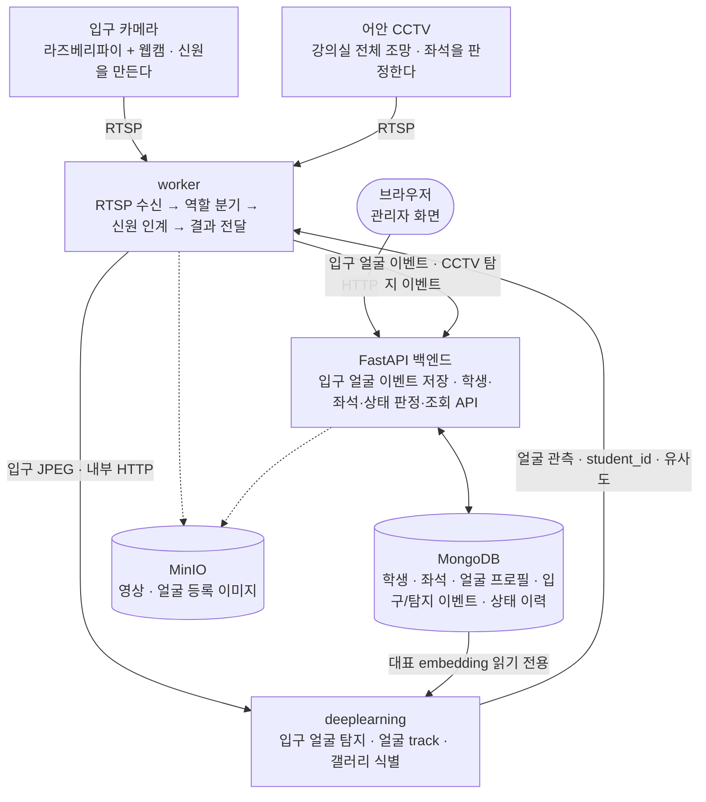
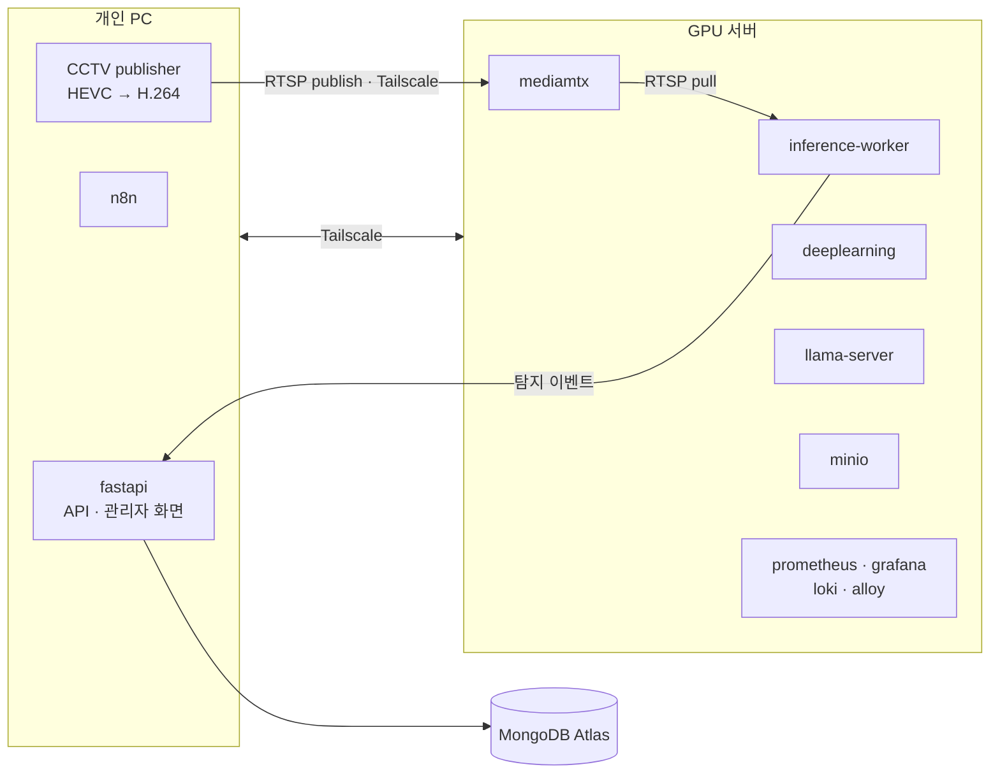

# 아키텍처

**목적**: 시스템이 어떤 블록으로 나뉘고, 그 블록이 저장소의 어느 디렉터리에 대응하며,
서로 어떤 방향으로 호출하는지 한 곳에서 파악한다.
**대상 독자**: 이 저장소에서 처음 작업을 시작하는 팀원과 AI 에이전트.

각 서비스의 내부 책임과 환경변수는 여기서 반복하지 않는다. 해당 서비스의 README에 있다.
확정된 기술 결정과 그 근거는 [결정 기록](./decisions.md)에 있다.
무엇을 만들 것인지는 [학생 모니터링 MVP 명세](../specs/student-monitoring-mvp.md)에 있다.

표기: (표기 없음) `사실` / `예정`(하기로 했으나 아직 없음) / `후보`(고려 중) / `결정 필요`(선택하지 않음)

## 이 시스템이 하는 일

강의실 카메라 영상에서 **학생을 식별**하고, 그 학생의 **현재 위치**를 **지정 좌석**과
**수업 시간 정책**에 결합해 관리자가 강의실 단위 학생 현황을 자동으로 확인하게 한다.

얼굴 인식은 학생을 식별하는 수단이고, 제품이 최종적으로 내놓는 것은 **학생 상태**다.

**식별과 위치는 서로 다른 카메라가 담당한다.** 입구 카메라가 지나가는 학생의 얼굴로
신원을 한 번 정하고, 그 신원을 트래킹으로 이어 강의실 전체를 보는 어안 CCTV에서 좌석을
판정한다. 좌석 화각에서는 얼굴을 인식하지 않는다
([결정 0024](./decisions.md#0024--카메라-구성을-전체-조망-cctv와-입구-카메라로-바꾸고-학생-식별을-입구-1회로-한정한다),
[0025](./decisions.md#0025--강의실-안-신원-유지를-bytetrack-트래킹으로-하고-인계-실패는-unknown으로-둔다)).

| 상태 | 의미 | 범위 |
| --- | --- | --- |
| `PRESENT` | 학생이 식별됐고 지정 좌석에 있다 | MVP |
| `WRONG_SEAT` | 학생이 식별됐으나 지정 좌석이 아니다 | MVP |
| `ABSENT` | 수업 시간 중 지정 좌석에서 유예 시간을 넘겨 미식별 | MVP |
| `IN_CLASSROOM` | 신원 있는 track이 교실 안에 있으나 어느 좌석 ROI에도 없다 | MVP. 트래킹이 핵심 경로가 되면서 편입됐다([0025](./decisions.md#0025--강의실-안-신원-유지를-bytetrack-트래킹으로-하고-인계-실패는-unknown으로-둔다)) |

## 시스템 구성



실선은 현재 구현된 경로다. 얼굴 식별과 카메라 간 신원 인계는 설정을 명시해야 켜진다.
worker는 입구에서 YOLO·사람 ByteTrack을 실행하지 않고 얼굴 관측만 만든다. CCTV에서는
얼굴 모델을 실행하지 않고 YOLO·ByteTrack만 실행하며, 입구에서 식별한 신원을 CCTV 문
영역에서 유일하게 새로 생긴 track에만 인계한다([0036](./decisions.md#0036--문-영역과-통과-시각으로-입구-신원을-cctv-bytetrack에-보수적으로-인계한다),
[0040](./decisions.md#0040--입구는-얼굴-관측-cctv는-사람-추적으로-실행-경로를-분리한다)).
입구와 CCTV는 역할별 최신 프레임 버퍼·소비자를 따로 쓰고, 신원은 새 관측이 지지하는
얼굴 track과 살아 있는 동일 CCTV track에만 유지한다
([0042](./decisions.md#0042--얼굴과-cctv의-신원-수명을-각-track의-관측-근거에-묶는다)).

**어안 CCTV의 왜곡 보정은 사람 탐지 이전에 한 번만 수행하고, 보정된 좌표계가 ROI와
bbox의 정본이다.** 구성도에 단계를 그리지 않은 것은 어느 서비스가 수행할지가 아직
`결정 필요`이기 때문이다(0024의 4번).

**다만 실제로 연결한 CCTV는 어안이 아니라 일반 광각이었다**(HEVC 1280×1944 15fps,
[0031](./decisions.md#0031--roi-기준-화면을-fastapi가-rtsp에서-직접-캡처한다)의 배경).
이 카메라를 쓰는 한 왜곡 보정 단계는 해당하지 않는다. 카메라를 바꿀지 전제를 고칠지는
`결정 필요`다.

**관리자 화면은 별도 서비스가 아니다.** FastAPI가 Jinja2로 직접 렌더링하는 같은
프로세스 안의 화면이다. 프론트엔드 서비스를 따로 두지 않는다.

## 블록과 디렉터리의 대응

| 구성도 블록 | 담당 디렉터리 | 상태 |
| --- | --- | --- |
| 관리자 화면 | [`webapps/fastapi`](../../webapps/fastapi/README.md) (`templates/`) | 강의실 좌석 현황·모니터링·검색 세 화면만 있다 |
| FastAPI 백엔드 API | [`webapps/fastapi`](../../webapps/fastapi/README.md) (`app/`) | 학생·좌석·얼굴 등록, 탐지 수신, 상태 판정·이력과 관리자 화면 구현 |
| 카메라 실시간 수신, 프레임 샘플링 | [`worker/stream`](../../worker/stream/README.md) | 동작. 다중 RTSP 소스 수신·재연결·샘플링. 로컬 저장은 개발용이며 기본 꺼짐 |
| 추론 실행 단계 | [`worker/inference`](../../worker/inference/README.md) | 입구 얼굴 관측 HTTP 호출·저장, CCTV 사람 탐지·ByteTrack, 문 영역·시각 기반 신원 인계, FastAPI 전달 구현. 사람 모델 직접 호출은 이관 대상([결정 0009](./decisions.md#0009--추론-책임을-모델과-실행으로-나눈다)) |
| 사람 탐지 · 얼굴 탐지 · 얼굴 인식 모델 | [`deeplearning`](../../deeplearning/README.md) | 사람 탐지 학습·평가, SCRFD·ArcFace/AdaFace 갤러리 식별·얼굴 추적·MediaPipe 자세 구현. 운영 사람 ByteTrack과 카메라 간 인계는 worker가 담당 |
| 학생 상태 판정 | `webapps/fastapi` | 구현됨. CCTV의 신원 있는 track을 좌석 ROI 근거와 결합해 수신 시점에 판정·저장·이력을 남긴다([결정 0032](./decisions.md#0032--학생-상태-판정을-좌석-근거-하나에서-파생시키고-수신-시점에-저장한다)) |
| MongoDB 저장 | `webapps/fastapi`의 어댑터 | 학생·강의실·좌석·얼굴 대표 embedding·탐지 이벤트·입구 얼굴 이벤트(7일 TTL)·상태 이력 구현. deeplearning은 대표 embedding만 읽기 전용 조회 |
| 영상을 객체 저장소에 적재 | [`worker/recorder`](../../worker/recorder/README.md) | 동작하나 **공용 서버에서 실행하지 않는다.** 영상 원본을 저장하지 않기로 했다([결정 0028](./decisions.md#0028--영상-원본을-저장하지-않고-스냅샷만-남긴다)) |
| 탐지 시점 스냅샷 적재 | [`worker/inference`](../../worker/inference/README.md) | 동작. 탐지 개수가 바뀌면 JPEG를 MinIO에 올린다([결정 0028](./decisions.md#0028--영상-원본을-저장하지-않고-스냅샷만-남긴다)). 기본은 꺼짐 |
| 스냅샷 조회 화면·API | `webapps/fastapi`의 `app/snapshots/` | 동작. MinIO 목록을 읽어 보여준다. 이미지는 fastapi가 프록시한다 |
| 지표·대시보드 | [`monitoring/internal`](../../monitoring/internal/README.md) | fastapi·worker·deeplearning 지표 수집과 Grafana 대시보드 2개(스택 상태·애플리케이션 지표). **알림 규칙은 `예정`** |
| 사용자용 실시간 영상 | [`monitoring/external`](../../monitoring/external/README.md) | `예정`. WebRTC로 확정. 코드 없음. 디렉터리 경계·접근 보호는 `결정 필요` |
| 업무 자동화 | [`RPAs`](../../RPAs/README.md) | `예정`. 코드 없음 |

## 실행 호스트 배치

**블록이 어느 디렉터리에 있는가와 어느 기계에서 도는가는 다른 문제다.** 위 표가 전자를,
아래가 후자를 말한다. 배치의 근거는 [결정 0026](./decisions.md#0026--백엔드를-개인-pc에-두고-gpu가-필요한-것만-gpu-서버에-남긴다)에 있다.



| 호스트 | 올라가는 것 |
| --- | --- |
| 개인 PC | `fastapi`(관리자 화면 포함), `n8n`, CCTV H.264 publisher |
| GPU 서버 | `inference-worker`, `deeplearning`, `llama-server`, `mediamtx`, `minio`, 모니터링 4종 |
| 클라우드 | MongoDB Atlas |

**두 호스트는 Tailscale로 잇는다.** GPU 서버는 공인 IP가 있지만 개인 PC는 없고,
worker가 탐지 이벤트를 fastapi로 보내는 방향과 개인 PC의 CCTV publisher가 GPU 서버
MediaMTX로 영상을 보내는 방향이 필요하다. CCTV 사설망을 GPU 서버에 route하지 않는
근거는 [결정 0037](./decisions.md#0037--개인-pc-publisher가-cctv를-gpu-서버-mediamtx로-송출한다)에 있다.

**이 분리로 fastapi의 거의 모든 프로세스 밖 호출이 네트워크 경계를 넘는다.** 어떤 호출이
넘고 어떤 호출이 넘지 않는지는 [0026의 3번 표](./decisions.md#0026--백엔드를-개인-pc에-두고-gpu가-필요한-것만-gpu-서버에-남긴다)가 정본이다. 특히 얼굴 등록의
실시간 가이드와 스냅샷 이미지 프록시가 이 경계 위에 놓인다.

**이 구성은 개발·검증용이며 운영 배포가 아니다.** 개인 PC는 운영 환경이 될 수 없다.

## 지금 동작하는 것과 목표의 거리

```text
입구 카메라 → deeplearning SCRFD·ArcFace/AdaFace → 얼굴 track·student_id
                                       ↑ 모델별 MongoDB 대표 embedding 갤러리
                               ├→ FastAPI 입구 얼굴 이벤트 7일 저장
                               │
                 문 영역·통과 시각의 유일 후보일 때만 신원 인계
                               ▼
CCTV → 학습 YOLO 사람 탐지 → CCTV ByteTrack ───────▶ FastAPI ROI·지정 좌석 상태 판정
```

입구 카메라 한 화각 안에서 특정 학생을 식별하고([0035](./decisions.md#0035--입구-얼굴-식별은-worker에서-deeplearning-내부-http로-호출한다)),
그 신원을 CCTV의 사람 track으로 넘겨 좌석까지 유지하는 코드 경로가 연결됐다. 입구 얼굴
track과 CCTV 사람 ByteTrack은 독립된 ID 공간을 쓴다. 후보 학생이나 CCTV 문 영역의 신규
track이 둘 이상이면 가까운 대상을 추측하지 않고 미식별로 둔다([0036](./decisions.md#0036--문-영역과-통과-시각으로-입구-신원을-cctv-bytetrack에-보수적으로-인계한다)).

두 실제 RTSP 경로와 학습 가중치의 worker 설정, CCTV의 H.264 게이트웨이까지 준비됐다.
남은 일은 유효한 MongoDB 연결과 평가로 확정한 얼굴 식별 임계값을 적용하고, CCTV 기준
프레임에서 문 영역 좌표와 시간 창을 실측 보정한 뒤 GPU 서버에서 전체 경로를 검증하는
것이다. 코드 경로의 존재와 현장 성능 검증은 구분한다.

## fastapi에 들어올 도메인

[결정 0001](./decisions.md#0001--fastapi-계층형-구조와-경계-포트)에 따라 기능(도메인)별
디렉터리로 나눈다. 계약은
[MVP 명세](../specs/student-monitoring-mvp.md)가 기준이다.

| 도메인 | 책임 | 상태 |
| --- | --- | --- |
| `classrooms` | 강의실, 좌석, 좌석 ROI, 좌석 점유 관측 | 구현됨 |
| `video_monitoring` | 영상 source 목록과 상태, 검색 | 데모까지 구현됨 |
| `students` | 학생 원장 — 식별자, 학번, 소속 강의실, 동의 상태 | 구현됨 |
| `face_enrollment` | 학생 ID와 얼굴 embedding의 연결, 등록 세션 | 구현됨 |
| `student_monitoring` | 탐지 결과 수신, 좌석 대조, 시간 정책, 학생 상태와 이력 | 구현됨([0032](./decisions.md#0032--학생-상태-판정을-좌석-근거-하나에서-파생시키고-수신-시점에-저장한다)). 수업 시간표 결합은 `예정` |

## 호출 방향 규칙

아래는 [AGENTS.md의 Architecture Rules](../agents/AGENTS.md#architecture-rules)와 같은 내용이며,
여기서는 그 배경을 설명한다.

### 제품 요청은 fastapi를 통하고 영상만 WebRTC로 MediaMTX에 연결한다

`deeplearning`과 `worker`를 브라우저에서 직접 부르지 않는다.
접근 통제를 한 곳에서 하고, 추론 결과 형식이 바뀌어도 영향 범위를
`fastapi` 안에 가두기 위해서다.

실시간 영상은 예외다. [결정 0027](./decisions.md#0027--실시간-관제-전달을-httpwebrtcsse로-구성한다)에
따라 fastapi가 재생 가능한 source를 판단하고, 브라우저는 허용된 WebRTC 세션에 한해
MediaMTX와 signaling·미디어 연결을 맺는다. 제품 API와 탐지 SSE는 계속 fastapi만
호출한다.

### 모델은 상태를 결정하지 않는다

모델의 출력은 `student_001, 신뢰도 0.87, bbox (100,120,300,600)`까지다.
이것을 `PRESENT`나 `WRONG_SEAT`으로 바꾸는 것은 `fastapi`의 일이다.

출결 정책이 바뀌어도 모델을 다시 학습하거나 배포하지 않고, 모델을 교체해도
업무 규칙이 유지되게 하려는 것이다. 배경은
[결정 0008](./decisions.md#0008--학생-상태-판정을-rule-engine으로-분리하고-fastapi가-소유한다)에 있다.

판정에서 지키는 것:

- 판단 기준(유예 시간, 신뢰도 임계값, 좌석 판정 여유)은 코드에 박지 않고 설정으로 둔다.
- `deeplearning`과 `worker`에 업무 상태 어휘(`PRESENT`, `ABSENT`)를 넣지 않는다.
- **미관측을 부재로 바꾸지 않는다.** 카메라 장애·가림과 학생의 부재는 다른 사실이다.
- 조회 GET은 상태를 바꾸지 않는다. 시간 정책은 명시적인 쓰기 요청에서만 평가한다.

### 모델을 아는 곳은 deeplearning 하나다

`worker/inference`는 프레임을 꺼내 호출하고 실패를 처리하는 실행 단계이고,
모델 종류·가중치·전처리는 `deeplearning`이 소유한다
([결정 0009](./decisions.md#0009--추론-책임을-모델과-실행으로-나눈다)).
얼굴 식별은 이 경계를 따른다. worker는 모델·갤러리를 알지 않고 deeplearning 내부
HTTP만 호출한다. 사람 탐지는 아직 `worker/inference`가 ultralytics를 직접 부르는
잠정 예외이며 이관 대상이다.

### 영상·얼굴 데이터와 메타데이터의 저장 책임을 분리한다

바이너리와 메타데이터는 보존 기간, 용량, 접근 권한이 전혀 다르다.
한 서비스가 둘 다 소유하지 않는다.

- 업무 메타데이터: `fastapi`가 MongoDB에 기록한다.
- **영상 원본: 저장하지 않는다.** 탐지 시점의 스냅샷만 MinIO에 남기고 메타데이터에는
  참조만 둔다([결정 0028](./decisions.md#0028--영상-원본을-저장하지-않고-스냅샷만-남긴다)).
  `worker/recorder`는 코드가 남아 있으나 공용 서버 스택에서 실행하지 않는다.
- 얼굴 등록 이미지: `fastapi`가 MinIO의 별도 버킷에 넣는다(`예정`). 영상과 버킷을
  나누는 이유는 보존 기간과 열람 주체가 다르고, 학생 요청으로 삭제할 수 있어야
  하기 때문이다([결정 0004](./decisions.md#0004--영상과-얼굴-이미지-저장소로-minio-채택)).

**상시 녹화는 하지 않는다.** 공용 GPU 서버의 가용 용량이 약 48 GB인데 1080p 카메라
한 대가 시간당 약 0.9 GB라 성립하지 않는다. 그래서
[결정 0007](./decisions.md#0007--recorder-worker의-저장-구조와-보존-정책)의 상시 녹화와
보존 기간 30일 기본값은 0011로 대체됐다.

스냅샷 값은 720p / JPEG 80 / 보존 30일 / 카메라당 최소 간격 60초로 정했다.
삭제는 앱이 아니라 MinIO lifecycle 규칙이 한다.

**접근 권한과 얼굴 데이터 정책은 여전히 `결정 필요`다 — 스냅샷에도 얼굴이 담긴다.**
지금은 worker와 fastapi가 모두 root 자격 증명으로 저장소에 붙는다.
`worker/stream`의 로컬 저장은 학습 데이터 확보용이며 기본값이 꺼져 있고
`APP_ENV=prod`에서는 켤 수 없다.

### 서비스 간 계약은 문서화된 것만 쓴다

각 서비스는 상대의 내부 구조를 모른 채 동작해야 한다.
worker는 [결정 0040](./decisions.md#0040--입구는-얼굴-관측-cctv는-사람-추적으로-실행-경로를-분리한다)에
따라 입구 JPEG만 deeplearning 내부 HTTP에 보내 얼굴 관측을 받고, 관측 메타데이터를
FastAPI 내부 HTTP에 저장한다. 그 뒤
[결정 0027](./decisions.md#0027--실시간-관제-전달을-httpwebrtcsse로-구성한다)에 따라
FastAPI 내부 HTTP로 탐지 이벤트를 보낸다. embedding과 얼굴 이미지는 두 응답에 넣지
않는다.

## 데이터 흐름

### 지금 동작하는 흐름

```text
브라우저 → fastapi 라우터 → 도메인 서비스 → 저장소 포트
        → memory 또는 MongoDB 어댑터 → JSON 응답 또는 Jinja2 화면
```

```text
카메라 ─RTSP─▶ MediaMTX → OpenCV(worker/stream)
                          → 프레임 샘플링 → 카메라별 최신 프레임 버퍼
                          → worker/inference ┬→ 입구: deeplearning HTTP
                                             │   └→ SCRFD·MongoDB 대표 embedding 대조
                                             │       └→ 얼굴 track·판정 → FastAPI 입구 이벤트
                                             ├→ CCTV: 학습 YOLO 사람 탐지 → ByteTrack
                                             │   └→ 문 영역·통과 시각이 유일할 때 신원 인계
                                             ├→ FastAPI CCTV 탐지 이벤트 HTTP 또는 로그
                                             │
                                             └→ 탐지 개수가 바뀌면 JPEG 스냅샷
                                                → MinIO (lifecycle이 30일 뒤 삭제)
                                                       ▲
                                    fastapi ───목록·이미지 읽기───┘
```

**영상 원본은 저장하지 않는다**(결정 0028). `worker/recorder`의 세그먼트 녹화 경로는
코드가 남아 있으나 공용 서버에서 실행하지 않는다.

fastapi는 스냅샷을 저장소에서 직접 읽고 탐지 이벤트는 worker HTTP로 받는다.
deeplearning은 FastAPI가 저장한 대표 embedding 컬렉션을 읽기 전용 자격 증명으로
주기적으로 읽는다. 입구의 `IDENTITY_ONLY` 이벤트는 좌석 판정을 덮지 않고, 인계된
CCTV `SEAT_JUDGING` track만 좌석의 학생 신원과 상태 근거가 된다.

### 학생 상태 흐름

| 단계 | 입력 | 출력 | 담당 | 상태 |
| --- | --- | --- | --- | --- |
| 1. 수집 | 카메라 영상 | 연속 프레임 | worker/stream | 구현됨 |
| 1-1. 어안 보정 | CCTV 프레임 | 평탄화된 프레임 | 수행 위치 `결정 필요` | `예정`([0024](./decisions.md#0024--카메라-구성을-전체-조망-cctv와-입구-카메라로-바꾸고-학생-식별을-입구-1회로-한정한다)) |
| 2. 샘플링 | 연속 프레임 | 역할별 최신 추론 프레임 | worker/stream | 구현됨. 입구 얼굴과 CCTV 사람 추적이 별도 버퍼·소비자·샘플링 주기를 사용([0042](./decisions.md#0042--얼굴과-cctv의-신원-수명을-각-track의-관측-근거에-묶는다)) |
| 3. 사람 탐지 | **CCTV 프레임만** | 사람 ROI·좌표·신뢰도 | deeplearning | 모델 소유는 deeplearning, 현재 실행은 worker/inference의 YOLO |
| 3-1. 트래킹 | CCTV 프레임별 사람 bbox·촬영 시각 | CCTV `track_id` | worker/inference | 구현됨. 고·저신뢰도 2단계 ByteTrack, 실제 촬영 시간 기반 이동 예측, 짧은 유실 buffer 적용. 만료 시 인계 신원도 즉시 제거. 입구에서는 실행하지 않음 |
| 4. 얼굴 탐지·인식 | **입구 카메라의** JPEG | 얼굴 track별 판정·`student_id`·유사도·품질 | deeplearning | 구현됨([0035](./decisions.md#0035--입구-얼굴-식별은-worker에서-deeplearning-내부-http로-호출한다), [0040](./decisions.md#0040--입구는-얼굴-관측-cctv는-사람-추적으로-실행-경로를-분리한다)). CCTV에서는 호출하지 않음 |
| 4-1. 입구 얼굴 관측 저장 | 처리 상태·얼굴 관측 메타데이터 | 7일 보존 이벤트 | worker → fastapi → MongoDB | 구현됨. 이미지·embedding·학생 이름·학번은 저장하지 않음 |
| 4-2. 카메라 간 신원 인계 | 등록된 입구 얼굴 track + CCTV 문 영역 신규 사람 track | 신원이 붙은 CCTV track | worker/inference | 구현됨([0036](./decisions.md#0036--문-영역과-통과-시각으로-입구-신원을-cctv-bytetrack에-보수적으로-인계한다)). 현장 문 ROI·시간 창 보정 필요 |
| 5. 전달 | 탐지 결과 | 수신된 이벤트 | worker → fastapi HTTP | 구현됨([결정 0027](./decisions.md#0027--실시간-관제-전달을-httpwebrtcsse로-구성한다)) |
| 6. 좌석 대조 | CCTV track 위치 + 좌석 ROI | 현재 좌석 / 지정 좌석 일치 여부 | fastapi | 구현됨 |
| 7. 상태 판정 | 좌석 근거 + 유예 시간 | 학생 상태 + 근거 + 이력 | fastapi | 구현됨([0032](./decisions.md#0032--학생-상태-판정을-좌석-근거-하나에서-파생시키고-수신-시점에-저장한다)). 수업 시간표 결합은 `예정` |
| 8. 저장·표시 | 상태·이벤트 | 이력과 화면 | fastapi | 화면 골격만 구현됨 |

- **2단계에서 모든 프레임을 추론에 보내지 않는다.** 샘플링 주기는 설정값으로 둔다.
- **4단계까지는 의미를 부여하지 않는다.** `student_001, track_7, conf 0.87`까지가 출력이다.
- **4-1단계가 이 파이프라인의 병목이자 가장 큰 위험이다.** 여기서 신원을 잘못 이으면
  다른 학생의 출결이 바뀐다. 이어붙일 근거가 부족하면 잇지 않고 `UNKNOWN`으로 둔다.
- **6~7단계에서 처음으로 업무 의미가 생긴다.**

각 단계는 다음 단계가 멈춰도 전체가 무너지지 않게 만든다.
**2→3단계에서 추론이 밀리면 프레임을 버린다.** 쌓아두면 결과가 가리키는 시점이
계속 과거로 밀리기 때문이며, 배경은
[결정 0006](./decisions.md#0006--워커-사이-프레임-전달을-최신-우선-버퍼로-한다)에 있다.
5단계는 HTTP timeout·제한 재시도·`event_id` 멱등 처리를 사용한다. 구체 timeout,
재시도 횟수, worker 전송 버퍼 정책과 내부 인증은 구현 계약에서 정한다.

### 얼굴 등록 흐름

```text
학생 등록 → 얼굴 샘플 수집 → 품질 판정(흐림·밝기·크기) → embedding 생성
        → Face Profile 저장(MongoDB 메타데이터 + MinIO 이미지)
```

품질 규칙·MediaPipe 자세 가이드·embedding 생성과 MongoDB 대표 embedding 저장이
구현됐다. 얼굴 프로필 삭제는 대표 embedding도 먼저 지워 다음 갤러리 갱신에서 더는
식별되지 않게 한다. 실제 데이터 운영 접근 권한과 재학 종료 자동 삭제 주체는 여전히
`결정 필요`다.

## 시스템 경계

### 행위자

| 행위자 | 무엇을 하는가 | 상태 |
| --- | --- | --- |
| 관리자 | 학생 등록, 지정 좌석 설정, 얼굴 등록, 강의실 현황 확인, 상태 수동 보정, 검색, RPA 승인 | 화면 일부만 구현됨 |
| 학생 | **사용자가 아니다.** 시스템의 관찰 대상이며 얼굴 등록 동의 주체다 | — |

MVP의 제품 사용자는 관리자 한 종류다
([결정 0010](./decisions.md#0010--mvp-제품-사용자를-관리자-하나로-한정한다)).
**현재 앱에는 인증이 없다.** 운영 접근 통제 방식이 `결정 필요`이며, 정해지기 전까지
`APP_ENV=prod` 배포를 하지 않는다.

### 외부 시스템

| 외부 시스템 | 관계 | 상태 |
| --- | --- | --- |
| 광각 CCTV | 강의실 전체 조망 영상 공급 | RTSP 정지 프레임 수신 확인. 문 영역·좌석 ROI 실측 보정 필요 |
| 입구 카메라 | 입구 영상 공급과 얼굴 학습 데이터 수집 | 현재 송출을 사용할 수 없음. GPU worker가 읽을 RTSP 경로 확정·검증 필요 |
| Jetson | 엣지 추론 | `예정`. 적용 범위 `결정 필요` |
| MongoDB | 운영 메타데이터 보관 | 구현됨 |
| MinIO | 영상·얼굴 이미지 보관 | `worker/recorder`가 영상을 적재·삭제한다. 얼굴 이미지는 `예정` |
| 기존 학사·출결 시스템 | RPA가 접근해 업무 대행 | 대상 미확정 |
| 알림 채널 | 관리자 승인 후 담당자·보호자에게 알림 | `결정 필요` |

### 시스템 밖에 두는 것

- 카메라 장비 자체의 설정과 펌웨어
- 학생 원장의 원본 관리 — 기존 학사 시스템이 있다면 그쪽이 정본이다
- 수업 시간표의 원본 관리 (`결정 필요` — 이 시스템이 들고 있을지 받아올지)
- 기존 출결 시스템의 기능 (RPA는 이를 **사용**할 뿐 대체하지 않는다)
- 알림 채널 자체의 운영

외부 시스템의 동작을 우리 쪽에서 흉내 내지 않는다. 연동이 불안정하면 감추지 말고
실패로 드러낸다.

### 제약

- **얼굴은 그 자체로 개인정보다.** 등록 동의, 저장 범위, 보존 기간, 접근 권한,
  삭제 절차가 아직 정해지지 않았다. 학생이 미성년자일 수 있어 동의 주체도 확인이 필요하다.
- **영상에도 얼굴이 담긴다.** `worker/recorder`가 합의보다 먼저 만들어졌으므로
  ([0007](./decisions.md#0007--recorder-worker의-저장-구조와-보존-정책)),
  합의를 미룰수록 지우기 어려운 데이터가 쌓인다.
- **출결은 사람에게 불이익을 줄 수 있는 판정이다.** 자동 판정만으로 통보하지 않고
  관리자 확인을 거친다. 판정 근거가 되는 이벤트를 되짚을 수 있어야 한다.
- **오인식은 다른 학생의 정보를 노출하는 사고다.** 신뢰도 미달은 `UNKNOWN`으로 두고
  억지로 이름을 붙이지 않는다.
- **장치는 자주 끊긴다.** 카메라 연결 실패를 예외가 아니라 정상 운영 중 발생하는 상태로 다룬다.
- **외부 시스템 접근 정보는 저장소에 두지 않는다.**
  [환경변수 규칙](../conventions/environment-convention.md)을 따른다.

## 미결정 항목

| 항목 | 상태 | 영향 |
| --- | --- | --- |
| 얼굴 데이터 운영 접근 권한과 재학 종료 자동 삭제 실행 주체 | 결정 필요 | local 구현은 가능하지만 **실제 얼굴의 prod 처리를 막는다**. 동의·보관·중단 삭제 정책은 [0011](./decisions.md#0011--얼굴-등록-실시간-경계와-데이터-수명)로 확정 |
| 영상 저장 범위·보존 기간·접근 권한 | 결정 필요 | 개인정보 합의 사항. **코드가 먼저 만들어져 기본값으로 동작 중**([0007](./decisions.md#0007--recorder-worker의-저장-구조와-보존-정책)) |
| 운영 접근 통제 방식(내부망 / reverse proxy / 상위 시스템 위임) | MVP 동안 미도입([0030](./decisions.md#0030--실시간-영상-접근-제어와-운영-배포를-mvp-동안-인증-최소화로-정한다)) | **prod 배포를 계속 막는다**([0010](./decisions.md#0010--mvp-제품-사용자를-관리자-하나로-한정한다)) |
| 스냅샷 버킷의 접근 권한과 전용 자격 증명 | 결정 필요 | 지금은 root 키로 붙는다. worker(쓰기)·fastapi(읽기)를 나눠야 한다 |
| 영상·스냅샷 접근 권한 | 결정 필요 | 개인정보 합의 사항. 스냅샷에도 얼굴이 담긴다 |
| 운영 접근 통제 방식(내부망 / reverse proxy / 상위 시스템 위임) | 결정 필요 | **prod 배포를 막는다**([0010](./decisions.md#0010--mvp-제품-사용자를-관리자-하나로-한정한다)) |
| 얼굴 탐지 모델 | 후보: SCRFD | deeplearning |
| 얼굴 인식 모델 | 단일 활성 모델 선택: ArcFace(기본) / AdaFace IR50 WebFace4M. AdaFace는 FAR 0.1% 검증 뒤 전환 | deeplearning |
| 사람 탐지 모델 버전 | 후보: YOLO 계열 (현재 코드는 YOLOv8n) | deeplearning, worker |
| 학습 데이터셋 확보·라벨링 정책 | 결정 필요. 입구 카메라가 수집을 겸하지만, 동의·보존·삭제 합의 전에는 실제 학생 얼굴을 수집하지 않는다([0024](./decisions.md#0024--카메라-구성을-전체-조망-cctv와-입구-카메라로-바꾸고-학생-식별을-입구-1회로-한정한다)의 5번) | deeplearning |
| 학습 가중치를 `worker/inference` 실행 환경까지 전달하는 방식 | dev는 gitignore 대상 `.docker/models/`를 GPU worker에 read-only bind mount하는 것으로 확정·구성됨. 모델 배포 자동화는 예정 | deeplearning, worker |
| `deeplearning` 호출 방식 | 내부 HTTP로 확정([0035](./decisions.md#0035--입구-얼굴-식별은-worker에서-deeplearning-내부-http로-호출한다)) | worker, deeplearning |
| 결석 유예 시간 값 | **결정 필요.** 설정(`STUDENT_ABSENT_GRACE_SECONDS`)으로 빠져 있고 기본값은 300초지만 **팀 합의값이 아니다**([0032](./decisions.md#0032--학생-상태-판정을-좌석-근거-하나에서-파생시키고-수신-시점에-저장한다)). 후보: 5 / 10 / 20 / 30분 | fastapi. 실제 촬영과 운영 요구 필요 |
| 신원 유지 시간 값 | **결정 필요.** `STUDENT_IDENTITY_HOLD_SECONDS` 기본 15초는 실측 근거가 없다. 짧으면 상태가 흔들리고 길면 자리를 뜬 학생이 재석으로 남는다 | fastapi |
| 좌석 판정 방식 | bbox 중심점과 카메라별 ROI로 확정([0019](./decisions.md#0019--실시간-학생-상태-연동은-카메라별-roi와-fastapi-판정을-사용한다)). 학생 상태와 좌석 점유 모두 ROI 하나만 쓴다([0020](./decisions.md#0020--좌석-위치-판정의-정본을-roi-하나로-통일한다)). **실측 결과 중심점 유지가 맞다** — 앉은 사람은 하반신이 책상에 가려 bbox 하단이 발이 아니라 책상 모서리에서 끊긴다 | fastapi |
| 좌석 ROI를 그리는 위치 | **실측으로 확정.** 책상이나 의자가 아니라 "그 자리에 앉았을 때 상체가 있는 공간"에 그린다. 앉은 사람 5명 전원의 bbox 중심이 상체 영역에는 들어가고 책상 영역에는 하나도 들어가지 않았다 | fastapi |
| 좌석 점유 판정의 시간 규칙 | **실측으로 확정.** 마지막 점유 관측 뒤 5초간 붙들어 둔다(`SEAT_OCCUPANCY_HOLD_SECONDS`). 앉은 사람도 프레임마다 잡히지 않아 붙들지 않으면 좌석이 몇 초마다 깜빡인다. **다수결 투표는 이 문제에 맞지 않는다** — 탐지 노이즈가 놓침 한 방향으로만 생겨 과반 요구가 놓침을 키운다(실측 오류 46 vs 붙들지 않음 27 vs 5초 유지 14) | fastapi |
| 사람 탐지 임계값과 추론 입력 크기 | **실측으로 확정.** `SEAT_OCCUPANCY_CONFIDENCE_THRESHOLD=0.3`, `INFERENCE_IMAGE_SIZE=1280`. 이전 값(0.6 / ultralytics 기본 640)은 실제 6명 중 1명만 통과시켰다. 근거는 각 `config/settings.yml` 주석에 있다 | fastapi, worker |
| 서 있는 사람과 앉은 사람의 구분 | **결정 필요.** 지나가는 사람의 bbox 중심이 옆자리 앉은 사람과 같은 높이라 좌석 ROI에 들어갈 수 있다. 현재 구분 수단이 없다 | fastapi, worker |
| 전체 조망 카메라가 좌석 판정을 덮어쓰는 문제 | **해소됨.** 카메라 역할(`SEAT_JUDGING` / `IDENTITY_ONLY`)을 `VideoStream`에 넣어 구현했다([0032](./decisions.md#0032--학생-상태-판정을-좌석-근거-하나에서-파생시키고-수신-시점에-저장한다)의 10번). `POST /api/v1/video-streams`에서 역할을 지정해 등록할 수 있다 | fastapi |
| ROI를 그릴 기준 화면 확보 방법 | 확정([0031](./decisions.md#0031--roi-기준-화면을-fastapi가-rtsp에서-직접-캡처한다)). fastapi가 RTSP에서 정지 프레임 한 장을 캡처한다. 실시간 영상 위에 그리지 않는다 | fastapi |
| **GPU 서버가 카메라 사설망에 닿는가** | 사설망 route 대신 개인 PC publisher가 CCTV를 H.264로 바꿔 GPU 서버 MediaMTX로 송출한다([0037](./decisions.md#0037--개인-pc-publisher가-cctv를-gpu-서버-mediamtx로-송출한다)). 공식 dev compose가 이 방향을 사용하며 CCTV 연속 디코딩은 실측했다 | worker, monitoring |
| 입구 카메라 영상을 넣는 방향 | 현재 송출을 사용할 수 없어 `결정 필요`. 로컬 테스트용 MediaMTX 경로를 공식 배치로 간주하지 않는다 | worker |
| 실제 CCTV의 화각과 코덱 | 입력은 HEVC(H.265), GPU MediaMTX에 송출되는 경로는 H.264로 변환한다. **어안이 아닌 일반 광각**이라 0024의 어안 전제와 다르다 — 카메라를 바꿀지 전제를 고칠지는 `결정 필요` | worker, deeplearning |
| 고정 화각 기반 ROI 자동 생성 | 확정·구현됨. 경로가 둘이다. **(1) 탐지 밀도**([0041](./decisions.md#0041--좌석-roi를-탐지-밀도에서-찾고-좌석-지정은-사람이-한다)) — 사람이 오래 앉아 있던 자리를 bbox 중심 밀도에서 찾는다. 실제 CCTV 24시간 기록에서 자리 14곳을 찾아 캡처 프레임에 겹쳐 확인했다. **좌석 지정은 사람이 한다** — 카메라는 자리를 알지만 좌석 이름을 알지 못한다. **(2) 좌석 격자 사영**([0039](./decisions.md#0039--좌석-roi-자동-생성을-좌석-격자와-네-모서리-호모그래피로-한다)) — 탐지 기록이 없는 카메라에서 쓴다. 실제 3A컴퓨터실에서는 격자와 배치가 어긋나 잘 맞지 않았다. 두 경로 모두 확정 전까지 `needs_review`로 판정에서 뺀다. **저장한 ROI로 좌석 판정이 맞게 도는지는 아직 확인하지 않았다** | fastapi |
| 수업 시간표의 원본 관리 주체 | 결정 필요 | fastapi |
| 카메라 대수와 역할 | 확정([0024](./decisions.md#0024--카메라-구성을-전체-조망-cctv와-입구-카메라로-바꾸고-학생-식별을-입구-1회로-한정한다)). 전체 조망 CCTV 1대 + 입구 카메라 1대. 현재 CCTV는 일반 광각으로 실측돼 0024의 어안 전제는 재검토가 필요하다 | worker, fastapi |
| 두 화각의 겹침 | 겹치지 않는다([0024](./decisions.md#0024--카메라-구성을-전체-조망-cctv와-입구-카메라로-바꾸고-학생-식별을-입구-1회로-한정한다)의 7번). 입구 카메라를 문쪽만 보게 두기 때문이며, 이 때문에 겹침 기반 신원 인계를 쓸 수 없다 | worker, deeplearning |
| 카메라 높이·화각·거리와 CCTV 화면상의 문 영역 | 결정 필요. 실제 촬영으로 확정한다. **문 영역이 신원 인계의 유일한 공간적 단서다** | worker, deeplearning |
| 입구 차폐 구간의 좌석 처리 | 확정([0024](./decisions.md#0024--카메라-구성을-전체-조망-cctv와-입구-카메라로-바꾸고-학생-식별을-입구-1회로-한정한다)의 6번). ROI를 등록하지 않아 `UNKNOWN`으로 둔다. 차폐 범위는 실제 촬영으로 확인한다 | fastapi |
| 작은 얼굴 대응 — Super Resolution 도입 여부 | 핵심 경로에서 빠졌다([0024](./decisions.md#0024--카메라-구성을-전체-조망-cctv와-입구-카메라로-바꾸고-학생-식별을-입구-1회로-한정한다)). 얼굴 인식을 얼굴이 크게 잡히는 입구에서만 한다 | deeplearning |
| **카메라 간 신원 인계 방법**(입구 track → CCTV track) | 확정·구현됨([0036](./decisions.md#0036--문-영역과-통과-시각으로-입구-신원을-cctv-bytetrack에-보수적으로-인계한다)). CCTV 문 영역 + 촬영 시각 창에서 학생·신규 track 쌍이 각각 하나일 때만 인계한다. 복수 후보는 미식별 유지 | worker, deeplearning, fastapi |
| 어안 왜곡 보정 수행 위치와 캘리브레이션 파라미터 확보 절차 | 결정 필요. 후보: `worker/stream` / `worker/inference` / 카메라·미디어 서버([0024](./decisions.md#0024--카메라-구성을-전체-조망-cctv와-입구-카메라로-바꾸고-학생-식별을-입구-1회로-한정한다)의 4번) | worker |
| 트래킹 구현 위치 | 사람 ByteTrack·카메라 간 신원 인계는 `worker/inference`, 얼굴 bbox+embedding track은 `deeplearning`으로 확정·구현됨([0036](./decisions.md#0036--문-영역과-통과-시각으로-입구-신원을-cctv-bytetrack에-보수적으로-인계한다), [0042](./decisions.md#0042--얼굴과-cctv의-신원-수명을-각-track의-관측-근거에-묶는다)) | worker, deeplearning |
| 입구에서 식별에 실패한 학생의 관리자 수동 지정 경로 | 결정 필요. 없으면 그날의 오판을 되돌릴 방법이 없다 | fastapi |
| 좌석을 비운 학생을 `ABSENT`로 볼지 `IN_CLASSROOM`으로 볼지 | 결정 필요. 유예 시간 정책과 함께 정한다 | fastapi |
| Tracking 도입과 `IN_CLASSROOM` | 확정([0025](./decisions.md#0025--강의실-안-신원-유지를-bytetrack-트래킹으로-하고-인계-실패는-unknown으로-둔다)). 트래킹이 신원 유지의 핵심 경로가 되어 MVP로 편입됐다 | worker, deeplearning, fastapi |
| 일반 모니터링 화면 갱신 방식 | 초기 REST + 이후 SSE로 확정([0019](./decisions.md#0019--실시간-학생-상태-연동은-카메라별-roi와-fastapi-판정을-사용한다)). 다중 프로세스 broker·replay는 결정 필요 | fastapi |
| 브라우저 영상 재생 방식(WebRTC 중계 / HLS) | 결정 필요 | fastapi, worker, monitoring |
| `monitoring/external`의 경계(설정·문서만 / 서비스 코드 포함) | 설정·문서만([0030](./decisions.md#0030--실시간-영상-접근-제어와-운영-배포를-mvp-동안-인증-최소화로-정한다)) | monitoring, fastapi |
| 자연어 검색 방식 | 확정([0016](./decisions.md#0016--자연어-검색에서-llm은-계획만-만들고-검증조회는-fastapi가-소유한다)). LLM은 검색 계획 JSON만 만들고 검증·조회는 fastapi가 한다. 조회 Tool을 모델에게 주지 않는다 | fastapi |
| 자연어 검색을 켜는 환경 | 확정([0021](./decisions.md#0021--자연어-검색을-gpu-서버에서만-켜고-그-밖의-환경에서는-기능을-끈다)). GPU 서버에서만 `llama`로 켜고 그 밖의 환경은 `disabled`. `stub`은 테스트 전용이다 | fastapi |
| 업무 자동화 오케스트레이션(n8n / LangGraph) | 결정 필요. 고도화 단계 | fastapi, RPAs |
| 캐시·큐 도입 여부 | 후보: Redis | fastapi |
| Jetson 적용 범위 | 결정 필요. 입구 카메라 노드는 라즈베리파이로 확정됐고([0024](./decisions.md#0024--카메라-구성을-전체-조망-cctv와-입구-카메라로-바꾸고-학생-식별을-입구-1회로-한정한다)) Jetson은 별개 항목이다 | worker |
| 알림 채널과 RPA 대상 시스템 | 결정 필요 | RPAs, fastapi |
| 통합 실행 수단(docker compose)의 공식화 | 확정([0018](./decisions.md#0018--docker-compose-구성을-저장소에-커밋하고-localdev-파일을-나눈다)). `.docker/`를 커밋하고 스택×환경으로 나눈다. 호스트 축 분할은 [0026](./decisions.md#0026--백엔드를-개인-pc에-두고-gpu가-필요한-것만-gpu-서버에-남긴다)의 남은 일 | 전체 |
| 실행 호스트 배치 | 확정([0026](./decisions.md#0026--백엔드를-개인-pc에-두고-gpu가-필요한-것만-gpu-서버에-남긴다)). 개인 PC에 fastapi, GPU 서버에 나머지, Tailscale로 연결. **개발·검증용이며 운영 배포가 아니다** | 전체 |
| 개인 PC가 꺼져 있을 때 worker의 탐지 이벤트 처리 | 결정 필요. 지금은 제한 재시도 후 버린다. 버퍼링 여부·보관 기간·복구 시 재전송이 정해지지 않았다 | worker |
| 얼굴 등록 실시간 가이드와 스냅샷 프록시의 경계 통과 지연 | 결정 필요. 측정 후 견딜 수 없으면 얼굴 분석만 개인 PC로 되돌리는 것을 검토한다([0026](./decisions.md#0026--백엔드를-개인-pc에-두고-gpu가-필요한-것만-gpu-서버에-남긴다)) | fastapi, deeplearning |
| 운영 배포 환경과 방식 | 결정 필요. 0026은 개발·검증 구성이고 운영 배포는 여전히 미정이다 | 전체 |

이 중 하나를 확정하면 [결정 기록](./decisions.md)에 한 항목을 추가하고,
이 표와 [루트 README의 미결정 항목](../../README.md#아직-결정되지-않은-항목)을 함께 갱신한다.

## 관련 문서

- [학생 모니터링 MVP 명세](../specs/student-monitoring-mvp.md) — 무엇을 만들 것인가
- [결정 기록](./decisions.md) — 확정된 기술 결정과 그 근거
- [AGENTS.md](../agents/AGENTS.md) — 에이전트 작업 계약
- [개발 규칙](../conventions/) — Git·코딩·API·환경변수·문서
