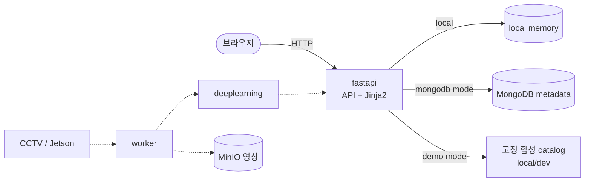

# 아키텍처 개요

**목적**: 스마트 오피스 모니터링 시스템을 구성하는 서비스들이 각각 무엇을 맡고
서로 어떻게 이어지는지 파악한다.
**대상 독자**: 이 저장소에서 처음 작업을 시작하는 팀원과 AI 에이전트.

각 서비스의 내부 책임과 환경변수는 반복하지 않는다.
해당 서비스의 README에 있고, 이 문서는 **서비스 사이의 관계**만 다룬다.

> 현재 실행 코드는 `fastapi`에만 있다. 서비스 분할과 호출 방향, metadata 저장소는 확정됐고
> 영상 수집·추론 서비스 간 통신 방식과 모델은 아직 결정되지 않았다.
> 표기: `확정` / `예정`(하기로 했으나 아직 없음) / `후보`(고려 중) / `결정 필요`(선택하지 않음)

## 서비스 구성

| 서비스 | 한 줄 역할 | 상태 |
| --- | --- | --- |
| [fastapi](../../webapps/fastapi/README.md) | 외부 요청의 유일한 진입점. API와 Jinja2 화면, 비즈니스 판단 | 구현됨 |
| [deeplearning](../../deeplearning/README.md) | 프레임에서 객체를 탐지해 결과 반환 | 예정 |
| [worker](../../worker/README.md) | 영상 수신과 프레임 공급 | 예정 |
| [monitoring](../../monitoring/README.md) | 서비스 상태·성능 관찰 | 예정 |
| [RPAs](../../RPAs/README.md) | 사무 업무 자동화 | 예정 |

## 서비스 관계

실선은 현재 구현된 경로다. 점선은 서비스 또는 계약이 아직 없는 예정 경로다. 합성 catalog는
실제 영상 파이프라인의 대역이 아니라 제품 화면 흐름만 확인하는 고정 local/dev 데이터다.

저장소는 [MongoDB](./decisions/ADR-0003-metadata-store-mongodb.md)와
[MinIO](./decisions/ADR-0004-object-storage-minio.md)로 확정됐다.
다만 **영상을 누가 어떤 범위로 저장할지는 아직 정해지지 않았다.**
fastapi 내부 구조는 [ADR-0002](./decisions/ADR-0002-fastapi-layered-with-ports.md)를 따른다.

## 관계 규칙

호출 방향에는 이유가 있다. 아래는 [AGENTS.md의 Architecture Rules](../agents/AGENTS.md#architecture-rules)와
같은 내용이며, 여기서는 그 배경을 설명한다.

### 브라우저 → fastapi (단일 경로)

브라우저는 `fastapi`만 호출한다. `deeplearning`과 `worker`를 직접 부르지 않는다.

화면은 `fastapi`가 Jinja2로 직접 렌더링하므로 별도 프론트엔드 서비스가 없다.
그래도 이 규칙은 유효하다. 첫째, 인증과 권한 판정을 한 곳에서 한다.
둘째, 추론 결과 형식이 바뀌어도 영향 범위가 `fastapi` 안에 머문다.

영상 스트림을 브라우저에서 직접 재생해야 하는 경우 이 규칙의 예외가 필요할 수 있다.
**결정 필요** 항목이며, 확정 시 ADR로 남긴다.

### fastapi가 판단하고, deeplearning는 판단하지 않는다

deeplearning의 출력은 "사람 1명 탐지, 신뢰도 0.87"까지다.
이것을 "재실 중"이나 "출근"으로 해석하는 것은 fastapi의 일이다.

모델을 교체해도 비즈니스 규칙이 그대로 유지되고, 반대로 판단 기준이 바뀌어도
모델을 다시 배포하지 않기 위해서다.

### 영상과 메타데이터의 저장 책임 분리

영상 바이트와 탐지 메타데이터는 보존 기간, 용량, 접근 권한이 전혀 다르다.
한 서비스가 둘 다 소유하지 않는다.

- 메타데이터: fastapi가 v2 도메인 데이터를 MongoDB에 기록
- 영상·스냅샷: MinIO에 보관하고 메타데이터에는 참조만 기록한다.
  다만 **저장 주체와 저장 범위·보존 기간은 결정 필요** 상태다.

### 서비스 간 계약

각 서비스는 상대의 내부 구조를 모른 채 동작해야 한다.
연동은 문서화된 API 또는 이벤트 스키마로만 한다.

실행 중인 서비스 사이의 계약은 아직 없다. 첫 계약을 정의할 때
[API 규칙](../conventions/api-convention.md)을 따른다.

## 미결정 항목

| 항목 | 상태 | 영향 |
| --- | --- | --- |
| 서비스 간 통신 방식(동기 HTTP / 메시지 큐) | 결정 필요 | fastapi·deeplearning·worker 구조 |
| 프레임 전달 방식(직접 전달 / 공유 저장소 / 큐) | 결정 필요 | worker, deeplearning |
| 실시간 화면 갱신 방식(폴링 / SSE / WebSocket) | 결정 필요 | fastapi |
| 캐시·큐 도입 여부 | 후보: Redis | fastapi |
| 영상 저장 주체(worker / fastapi) | 결정 필요 | worker, fastapi |
| 영상 저장 범위·접근 권한 | 결정 필요 | 개인정보 관련, 합의 사항 |
| 모델 종류와 버전 | 후보: YOLO 계열 | deeplearning |
| 영상 수신 프로토콜 | 후보: RTSP / WebRTC / HTTP 푸시 | worker |
| 영상·메타데이터 보존 기간 | 결정 필요 | 저장 정책 |
| 배포 환경과 방식 | 결정 필요 | 전체 |

이 중 하나를 확정하면 [ADR](./decisions/README.md)로 남기고
이 표와 루트 README의 미결정 항목 목록을 함께 갱신한다.

## 관련 문서

- [시스템 컨텍스트](./system-context.md) — 외부 행위자와 외부 시스템
- [데이터 흐름](./data-flow.md) — 영상이 화면에 닿기까지의 경로
- [결정 기록(ADR)](./decisions/README.md)
- [AGENTS.md](../agents/AGENTS.md) — 에이전트 작업 계약
