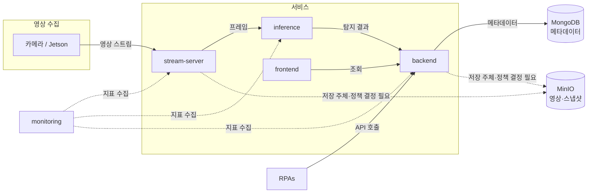

# 아키텍처 개요

**목적**: 스마트 오피스 모니터링 시스템을 구성하는 서비스들이 각각 무엇을 맡고
서로 어떻게 이어지는지 파악한다.
**대상 독자**: 이 저장소에서 처음 작업을 시작하는 팀원과 AI 에이전트.

각 서비스의 내부 책임과 환경변수는 반복하지 않는다.
해당 서비스의 README에 있고, 이 문서는 **서비스 사이의 관계**만 다룬다.

> 현재 단계에서 확정된 것은 **서비스 분할과 호출 방향**뿐이다.
> 통신 방식, 저장소, 모델은 아직 결정되지 않았다.
> 표기: `확정` / `예정`(하기로 했으나 아직 없음) / `후보`(고려 중) / `결정 필요`(선택하지 않음)

## 서비스 구성

| 서비스 | 한 줄 역할 | 상태 |
| --- | --- | --- |
| [frontend](../../webapps/frontend/README.md) | 상태를 보여주는 대시보드 | 예정 |
| [backend](../../webapps/backend/README.md) | 외부 요청의 유일한 진입점, 비즈니스 판단 | 예정 |
| [inference](../../webapps/inference/README.md) | 프레임에서 객체를 탐지해 결과 반환 | 예정 |
| [stream-server](../../webapps/stream-server/README.md) | 영상 수신과 프레임 공급 | 예정 |
| [monitoring](../../webapps/monitoring/README.md) | 서비스 상태·성능 관찰 | 예정 |
| [RPAs](../../RPAs/README.md) | 사무 업무 자동화 | 예정 |

## 서비스 관계

실선은 확정된 호출 방향이고, 점선은 존재 여부나 방식이 아직 결정되지 않은 경로다.

저장소는 [MongoDB](./decisions/ADR-0003-metadata-store-mongodb.md)와
[MinIO](./decisions/ADR-0004-object-storage-minio.md)로 확정됐다.
다만 **영상을 누가 어떤 범위로 저장할지는 아직 정해지지 않았다.**
backend 내부 구조는 [ADR-0002](./decisions/ADR-0002-backend-layered-with-ports.md)를 따른다.

## 관계 규칙

호출 방향에는 이유가 있다. 아래는 [AGENTS.md의 Architecture Rules](../agents/AGENTS.md#architecture-rules)와
같은 내용이며, 여기서는 그 배경을 설명한다.

### frontend → backend (단일 경로)

프론트엔드는 backend만 호출한다. inference와 stream-server를 직접 부르지 않는다.

이유는 두 가지다. 첫째, 인증과 권한 판정을 한 곳에서 한다. 둘째, 추론 서비스의
결과 형식이 바뀌어도 프론트엔드가 깨지지 않는다.

영상 스트림을 브라우저에서 직접 재생해야 하는 경우 이 규칙의 예외가 필요할 수 있다.
**결정 필요** 항목이며, 확정 시 ADR로 남긴다.

### backend가 판단하고, inference는 판단하지 않는다

inference의 출력은 "사람 1명 탐지, 신뢰도 0.87"까지다.
이것을 "재실 중"이나 "출근"으로 해석하는 것은 backend의 일이다.

모델을 교체해도 비즈니스 규칙이 그대로 유지되고, 반대로 판단 기준이 바뀌어도
모델을 다시 배포하지 않기 위해서다.

### 영상과 메타데이터의 저장 책임 분리

영상 바이트와 탐지 메타데이터는 보존 기간, 용량, 접근 권한이 전혀 다르다.
한 서비스가 둘 다 소유하지 않는다.

- 메타데이터: backend가 MongoDB에 기록 (`예정`)
- 영상·스냅샷: MinIO에 보관하고 메타데이터에는 참조만 기록한다.
  다만 **저장 주체와 저장 범위·보존 기간은 결정 필요** 상태다.

### 서비스 간 계약

각 서비스는 상대의 내부 구조를 모른 채 동작해야 한다.
연동은 문서화된 API 또는 이벤트 스키마로만 한다.

현재 확정된 계약은 없다. 첫 계약을 정의할 때
[API 규칙](../conventions/api-convention.md)을 따른다.

## 미결정 항목

| 항목 | 상태 | 영향 |
| --- | --- | --- |
| 서비스 간 통신 방식(동기 HTTP / 메시지 큐) | 결정 필요 | backend·inference·stream-server 구조 |
| 프레임 전달 방식(직접 전달 / 공유 저장소 / 큐) | 결정 필요 | stream-server, inference |
| 실시간 전달 방식(WebSocket / SSE / 폴링) | 결정 필요 | frontend, backend |
| 캐시·큐 도입 여부 | 후보: Redis | backend |
| 영상 저장 주체(stream-server / backend) | 결정 필요 | stream-server, backend |
| 영상 저장 범위·접근 권한 | 결정 필요 | 개인정보 관련, 합의 사항 |
| 모델 종류와 버전 | 후보: YOLO 계열 | inference |
| 영상 수신 프로토콜 | 후보: RTSP / WebRTC / HTTP 푸시 | stream-server |
| 영상·메타데이터 보존 기간 | 결정 필요 | 저장 정책 |
| 배포 환경과 방식 | 결정 필요 | 전체 |

이 중 하나를 확정하면 [ADR](./decisions/README.md)로 남기고
이 표와 루트 README의 미결정 항목 목록을 함께 갱신한다.

## 관련 문서

- [시스템 컨텍스트](./system-context.md) — 외부 행위자와 외부 시스템
- [데이터 흐름](./data-flow.md) — 영상이 화면에 닿기까지의 경로
- [결정 기록(ADR)](./decisions/README.md)
- [AGENTS.md](../agents/AGENTS.md) — 에이전트 작업 계약
