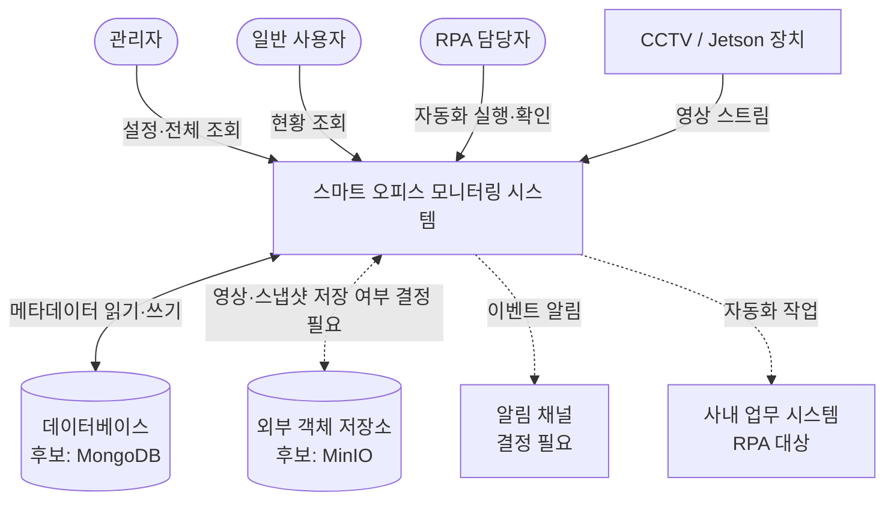

# 시스템 컨텍스트

**목적**: 시스템의 경계를 정한다. 누가 이 시스템을 쓰고, 무엇이 시스템 밖에 있는지 구분한다.
**대상 독자**: 기능 범위를 판단해야 하는 팀원과 AI 에이전트.

시스템 내부의 서비스 구성은 [아키텍처 개요](./overview.md)에 있다.
이 문서는 **경계 바깥**을 다룬다.

> 현재 단계에서 외부 연동은 하나도 구현되어 있지 않다.
> 아래는 예상되는 행위자와 외부 시스템이며, 실제 연동 대상은 확정 시 갱신한다.

## 컨텍스트 다이어그램

점선은 도입 여부나 방식이 아직 결정되지 않은 연동이다.

## 행위자

| 행위자 | 시스템으로 무엇을 하는가 | 상태 |
| --- | --- | --- |
| 관리자 | 카메라·임계값 설정, 전체 이벤트 조회, 사용자 권한 관리 | 예정 |
| 일반 사용자 | 자신에게 허용된 범위의 현황 조회 | 예정 |
| RPA 담당자 | 자동화 실행 결과 확인, 사람 확인이 필요한 단계 처리 | 예정 |

권한 모델(역할 구분, 조회 범위)은 **결정 필요** 항목이다.
관리자와 일반 사용자를 어떤 기준으로 나눌지 확정한 뒤 구현한다.

## 외부 시스템

| 외부 시스템 | 관계 | 상태 |
| --- | --- | --- |
| CCTV / Jetson 장치 | 영상 스트림을 시스템에 공급한다 | 예정 (프로토콜 결정 필요) |
| 데이터베이스 | 탐지 메타데이터와 설정을 보관한다 | 후보: MongoDB |
| 외부 객체 저장소 | 영상·스냅샷을 보관한다 | 후보: MinIO, 도입 여부 결정 필요 |
| 알림 채널 | 이벤트 발생 시 담당자에게 알린다 | 결정 필요 |
| 사내 업무 시스템 | RPA가 접근해 업무를 대행한다 | 대상 시스템 미확정 |

## 경계 판단 기준

기능을 어디에 만들지 헷갈릴 때 아래를 기준으로 판단한다.

**시스템 안에서 만든다**

- 영상 수신, 추론, 결과 저장, 조회 API, 대시보드
- 위 기능을 관찰하는 지표와 알림 규칙

**시스템 밖에 둔다**

- 카메라 장비 자체의 설정과 펌웨어
- 사내 계정 체계와 조직 정보의 원본 관리
- 사내 업무 시스템의 기능(RPA는 이를 **사용**할 뿐 대체하지 않는다)
- 알림 채널 자체의 운영

외부 시스템의 동작을 우리 쪽에서 흉내 내지 않는다.
연동이 불안정하면 감추지 말고 실패로 드러낸다.

## 제약과 고려 사항

- **영상은 개인정보를 포함한다.** 저장 범위, 보존 기간, 접근 권한을 정하지 않은 상태로
  영상을 저장하는 기능을 만들지 않는다. 이는 **결정 필요** 항목이다.
- **장치는 자주 끊긴다.** 카메라 연결 실패를 예외 상황이 아니라 정상 운영 중 발생하는
  상태로 다룬다.
- **외부 시스템 접근 정보는 저장소에 두지 않는다.** [환경변수 규칙](../conventions/environment-convention.md)을 따른다.

## 관련 문서

- [아키텍처 개요](./overview.md)
- [데이터 흐름](./data-flow.md)
- [결정 기록(ADR)](./decisions/README.md)
